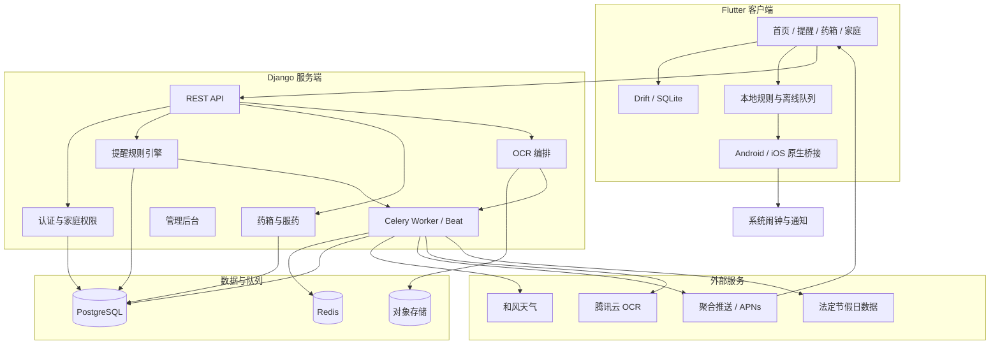
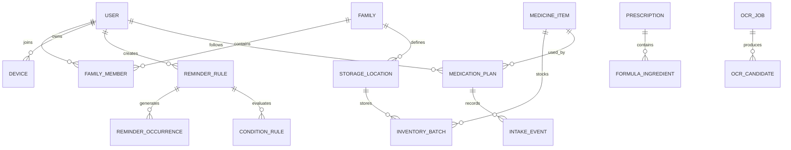
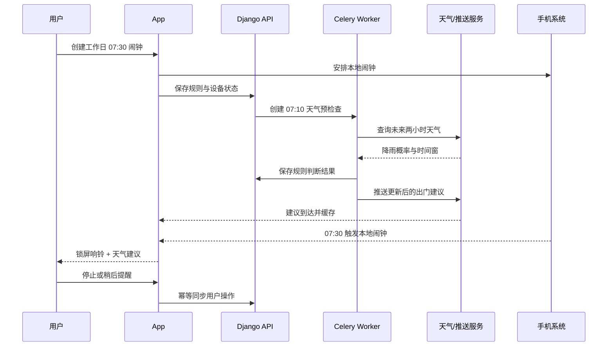
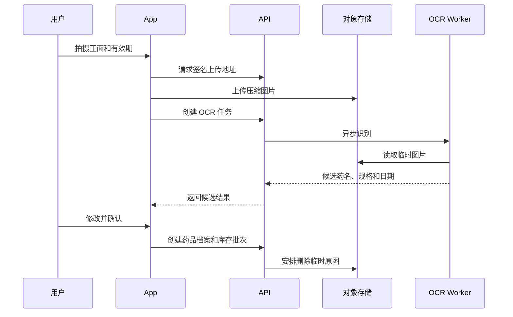

# 智能生活提醒与家庭药箱系统设计

- 文档版本：1.0
- 日期：2026-08-03
- 状态：待用户最终评审
- 产品阶段：亲友内测，架构面向后续公开上架
- 首发策略：Flutter 双平台架构，Android 首发，iPhone 第二阶段

## 1. 产品定义

产品定位为“面向个人和家庭的智能生活提醒助手”。它不只是记录时间，而是在提醒发生前查询天气、节假日、库存和有效期等条件，再选择合适的时间、渠道和提醒强度。

首版解决四个高频问题：

1. 工作日闹钟在响铃时同时给出天气和出门建议。
2. 用药计划按时提醒，并允许本人或家庭管理员确认服药状态。
3. 家庭药箱管理大量药品、库存批次、存放位置和有效期。
4. 洗车、节前买票等生活事项可在满足条件时提醒，而不是机械地定时通知。

产品只提供提醒、记录和库存管理，不提供诊断、处方建议、剂量推荐或替代医生判断。

## 2. 已确认决策

| 决策 | 结论 | 原因 |
|---|---|---|
| 产品载体 | App 为主 | 小程序无法稳定承载长期闹钟、锁屏交互和持续提醒 |
| 客户端 | Flutter | 复用 UI 与业务逻辑，同时保留原生闹钟桥接能力 |
| 首发平台 | Android | 精确闹钟和通知能力更适合先完成核心闭环 |
| iPhone | 第二阶段 | iOS 26+ 接入 AlarmKit，旧系统降级为本地通知 |
| 发布路径 | 亲友内测后公开上架 | 控制个人开发者早期成本，同时不牺牲数据隔离和扩展性 |
| 后端 | Django + DRF | 内置管理后台、ORM 和权限基础，降低个人运维成本 |
| 调度 | Celery + Redis | 支持天气预检查、过期扫描、重试和幂等任务 |
| 数据库 | PostgreSQL | 适合家庭关系、库存批次和审计数据 |
| 药箱设计 | 药品档案与库存批次分离 | 同一种药可能有多盒、不同有效期和存放位置 |
| 中药能力 | 首版保留方剂和处方结构 | 先拍照并手动确认，不自动识别每味饮片和剂量 |

## 3. 范围

### 3.1 内测版必须完成

- 账号、设备注册和家庭邀请。
- 个人提醒与家庭共享提醒。
- 工作日闹钟、重复日、法定节假日跳过。
- 闹钟前天气查询和带伞、添衣提示。
- 普通提醒、重要通知、闹钟三种等级。
- 用药计划、已服用、稍后提醒和漏服记录。
- 大容量家庭药箱、搜索、筛选、位置和批次管理。
- 药盒拍照、OCR 提取药名和有效期、人工确认。
- 有效期、开封期和低库存提醒。
- 洗车前未来三天降雨判断。
- 节假日前买票模板。
- Django 管理后台、日志、备份和异常任务查看。

### 3.2 公开版前补齐

- 手机号登录、Apple 登录和账号注销。
- 隐私政策、敏感个人信息单独同意、第三方 SDK 清单。
- 数据导出、家庭关系解除和完整删除流程。
- Android 主流厂商渠道测试和 iPhone 适配。
- 应用商店素材、审核说明、用户反馈与客服入口。
- 域名、备案、软件著作权及适用的应用分发材料。

### 3.3 暂不实现

- AI 自动诊断或剂量建议。
- 自动识别中药处方中每味饮片和精确剂量。
- 保险、在线问诊、药品销售和处方流转。
- 可穿戴设备和智能药盒硬件接入。
- 开放式自然语言规则生成。

## 4. 用户与权限

### 4.1 角色

| 角色 | 能力 |
|---|---|
| 个人用户 | 管理自己的提醒、药品、服药记录和隐私设置 |
| 家庭管理员 | 邀请成员、管理家庭药箱、查看成员授权共享的状态 |
| 普通家庭成员 | 使用共享药箱，决定哪些个人数据对管理员可见 |
| 被照护成员 | 接收提醒；可仅共享服药完成状态，不共享疾病备注 |
| 平台管理员 | 处理账号、任务和技术异常；默认不可查看用户健康备注原文 |

### 4.2 权限原则

- 个人数据默认私有，加入家庭不等于自动共享全部数据。
- 药品可以属于个人，也可以属于家庭药箱。
- 用药计划必须指定实际服药人；家庭管理员只能在授权后查看状态。
- 删除家庭成员不会删除其个人数据，只解除家庭资源访问权。
- OCR 原图默认短期保存，识别确认后自动删除；处方原图需单独选择长期保存。

## 5. 功能设计

### 5.1 首页

首页只展示需要行动的信息，不平铺全部药品：

- 当前天气与未来两小时风险。
- 下一个闹钟及工作日、节假日状态。
- 今日提醒时间线。
- 待服药、即将过期、低库存和条件判断结果。
- 模板快捷入口：出门、洗车、买票和服药。

### 5.2 智能提醒

提醒由“触发器、条件、动作”组成：

- 触发器：固定时间、重复日、节日前 N 天、到期前 N 天、库存阈值。
- 条件：天气、工作日、法定节假日、未来降雨、库存、成员状态。
- 动作：系统闹钟、重要通知、普通通知、家庭升级通知。

默认模板：

| 模板 | 触发 | 条件 | 动作 |
|---|---|---|---|
| 工作日出门 | 周一至周五 07:30 | 跳过节假日，提前查两小时天气 | 闹钟 + 出门建议 |
| 洗车 | 周六 09:00 | 未来三天无明显降雨 | 普通通知；有雨时建议取消 |
| 节前买票 | 目标节日前 30 天 | 尚未标记已购票 | 重要通知 |
| 用药 | 用药计划时间 | 未暂停、药品未用完 | 带操作按钮的重要通知 |
| 药品到期 | 到期前 90/30/7 天 | 库存仍大于零 | 普通通知，临期升级 |

### 5.3 提醒等级

| 等级 | 用途 | 手机交互 |
|---|---|---|
| L1 闹钟 | 工作日闹钟、用户明确选择的强提醒 | 响铃、锁屏展示、停止、贪睡；通知栏保留状态 |
| L2 重要通知 | 服药、漏服、临期、买票 | 通知栏操作按钮；可再次提醒或升级给家庭管理员 |
| L3 普通通知 | 洗车建议、低风险天气、普通库存信息 | 普通消息栏通知，点击进入详情 |

### 5.4 家庭药箱

药箱采用紧凑列表而非大量卡片，支持几十到上百种药品：

- 搜索：药名、拼音首字母、条码和备注。
- 筛选：家庭成员、药品分类、存放位置、有效期、开封状态、库存状态。
- 视图：在用、备用、即将过期、已过期、库存不足。
- 批量操作：移动位置、标记用完、调整数量、删除和导出。
- 存放位置：家庭药箱、冰箱、父母房间等自定义位置。
- 连续扫描：完成一盒确认后立即进入下一盒拍摄。

同一药品可以有多个库存批次。例如两盒布洛芬共享药品档案，但分别记录数量、有效期、开封日期和位置。

### 5.5 中药与方剂占位

中药方剂作为独立类型存在，字段包括：

- 方剂名称、医院、医生、处方日期和处方编号。
- 剂数、剩余袋数、服用方法、煎煮方法和存放条件。
- 建议使用期限与原始处方图片。
- 可选饮片组成列表：名称、剂量、单位和备注。

内测版只提供处方拍照、手动确认和整体提醒，不承诺自动识别全部饮片。

### 5.6 OCR 录入

1. App 引导用户分别拍摄药盒正面和有效期区域。
2. 图片经压缩和裁切后用签名地址上传对象存储。
3. OCR 任务提取候选药名、规格、批号和日期。
4. 日期解析器识别“有效期至、EXP、失效期”等格式。
5. 用户必须确认或修改结果后才能写入正式药箱。
6. 默认在确认后删除原图；失败任务最多保留 24 小时用于重试。

OCR 结果永远是候选值，不直接触发服药或丢弃药品等高风险动作。

## 6. 总体架构



架构图的独立 Mermaid 源文件位于 `docs/architecture.mmd`。

## 7. 客户端架构

Flutter 代码按功能模块组织：

```text
lib/
  app/                 路由、主题、依赖注入
  core/                网络、存储、同步、权限、日志
  features/
    auth/
    home/
    reminders/
    medicine_cabinet/
    medication_plans/
    family/
    ocr_capture/
    settings/
  platform/            闹钟、通知、推送 token 的平台通道
```

关键客户端组件：

- Drift/SQLite：缓存提醒、药箱摘要、节假日和待同步操作。
- Repository 层：UI 不直接依赖 HTTP 或 SQLite。
- Sync Queue：离线操作带唯一 `operation_id`，恢复网络后幂等重放。
- Alarm Adapter：统一接口封装 Android AlarmManager 与 iOS AlarmKit/本地通知。
- Notification Router：把通知点击和操作按钮路由到提醒详情或服药确认。
- Permission Center：集中解释通知、精确闹钟、相机和照片权限用途。

### 7.1 Android 闹钟

- 工作日闹钟优先使用 `AlarmManager` 的闹钟语义安排本地触发。
- Android 12+ 的精确闹钟需要按系统版本和商店政策处理特殊访问权限。
- Android 14+ 对全屏通知意图限制更严格，只在用户明确创建“闹钟级”提醒时使用。
- 设备重启、系统时间和时区变化后重新计算并安排未来闹钟。
- 通知渠道分为“闹钟、用药、一般生活提醒”，用户可分别设置声音和振动。
- 国内厂商省电策略可能影响后台行为，设置页提供可检测、可解释的授权指引。

### 7.2 iPhone 闹钟

- iOS 26+ 使用 AlarmKit，支持一次性和重复闹钟、贪睡及系统管理的闹钟展示。
- 低于 iOS 26 的设备使用本地通知降级，产品明确提示无法保证与系统闹钟相同的强提醒体验。
- 天气和家庭推送使用 APNs；本地闹钟不依赖推送到达。

## 8. 服务端架构

推荐版本与组件：

- Python 3.13。
- Django 5.x + Django REST Framework。
- PostgreSQL 16+。
- Redis 7+。
- Celery Worker + Celery Beat。
- S3 兼容对象存储。
- Nginx + Gunicorn。
- Docker Compose 用于开发、内测和早期生产部署。

Django 应用边界：

| 应用 | 职责 |
|---|---|
| accounts | 用户、登录、注销、设备和同意记录 |
| families | 家庭、成员、邀请和共享权限 |
| reminders | 规则、条件、实例、用户动作和升级策略 |
| medicines | 药品档案、批次、位置、中药方剂和库存 |
| medication | 用药计划、服药事件和漏服状态 |
| ocr | 上传、任务、候选字段、人工确认和删除策略 |
| notifications | 推送模板、设备通道、发送记录和回执 |
| calendars | 节假日、工作日调整和版本发布 |
| audit | 敏感操作审计与管理员访问记录 |

## 9. 核心数据模型



### 9.1 主要表

| 实体 | 关键字段 |
|---|---|
| User | id, display_name, timezone, locale, status, deleted_at |
| Device | user_id, platform, push_token, app_version, permission_state, last_seen_at |
| Family | id, name, owner_id |
| FamilyMember | family_id, user_id, role, sharing_scope, status |
| StorageLocation | family_id, name, parent_id, temperature_type |
| ReminderRule | owner_id, family_id, title, timezone, trigger_type, schedule_json, severity, enabled |
| ConditionRule | reminder_id, condition_type, operator, parameters_json, fallback_policy |
| ReminderOccurrence | reminder_id, scheduled_at, evaluated_at, decision, status, idempotency_key |
| MedicineItem | owner_scope, name, alias, category, dosage_form, strength, barcode |
| InventoryBatch | medicine_id, location_id, quantity, unit, expiry_date, opened_at, discard_after_opening |
| MedicationPlan | subject_user_id, medicine_id, dosage_text, schedule_json, escalation_policy |
| IntakeEvent | plan_id, scheduled_at, action, acted_by, acted_at, source_device_id |
| Prescription | owner_id, type, hospital, doctor, prescribed_at, directions, image_asset_id |
| FormulaIngredient | prescription_id, name, amount, unit, note |
| OCRJob | user_id, asset_id, provider, status, expires_at, error_code |
| OCRCandidate | job_id, field_name, raw_text, normalized_value, confidence, confirmed_value |
| NotificationDelivery | occurrence_id, device_id, channel, provider_message_id, status, attempted_at |
| AuditLog | actor_id, action, target_type, target_id, metadata, created_at |

所有业务实体使用 UUID。时间统一以 UTC 保存，同时记录规则时区；客户端按用户时区展示。

## 10. 规则引擎

提醒规则使用结构化 JSON 存储，不使用任意代码表达式。示例：

```json
{
  "trigger": {
    "type": "weekly_time",
    "time": "07:30",
    "weekdays": [1, 2, 3, 4, 5],
    "skip_public_holidays": true
  },
  "precheck": {
    "minutes_before": 20,
    "conditions": [
      {
        "type": "precipitation_probability",
        "window_minutes": 120,
        "operator": ">=",
        "value": 40
      }
    ]
  },
  "actions": {
    "default": "alarm",
    "condition_met_message": "未来两小时可能有雨，建议带伞"
  }
}
```

执行原则：

- 每个实例使用稳定的幂等键，重复任务不会重复发送。
- 服务端负责条件计算，本地负责闹钟可靠触发。
- 条件服务失败时执行规则声明的降级策略，不静默取消闹钟。
- 用户编辑规则后，客户端和服务端都撤销旧实例并生成新版本。
- 天气结果保存来源、观测时间和有效期，避免使用过期数据。

## 11. 关键数据流

### 11.1 工作日天气闹钟



### 11.2 药盒 OCR



## 12. API 设计

API 统一使用 `/api/v1`，返回稳定错误码和 `request_id`。

| 方法与路径 | 用途 |
|---|---|
| POST `/auth/otp/request` | 请求登录验证码 |
| POST `/auth/otp/verify` | 登录并签发访问与刷新令牌 |
| POST `/devices` | 注册设备、推送 token 和权限状态 |
| GET/POST `/families` | 查看或创建家庭 |
| POST `/families/{id}/invitations` | 创建家庭邀请 |
| PATCH `/families/{id}/members/{member_id}` | 修改角色和共享范围 |
| GET/POST `/reminders` | 查询或创建提醒规则 |
| PATCH `/reminders/{id}` | 修改、启停提醒 |
| POST `/occurrences/{id}/actions` | 停止、贪睡、已完成、已服用 |
| GET/POST `/medicines` | 药品档案搜索和创建 |
| GET/POST `/inventory-batches` | 库存批次查询和创建 |
| POST `/inventory-batches/bulk-actions` | 批量移动、标记用完或删除 |
| GET/POST `/medication-plans` | 用药计划 |
| GET `/intake-events` | 服药记录与家庭授权视图 |
| POST `/uploads/presign` | 获取受限上传地址 |
| POST `/ocr/jobs` | 创建 OCR 任务 |
| GET `/ocr/jobs/{id}` | 查询候选结果 |
| POST `/ocr/jobs/{id}/confirm` | 人工确认并写入药箱 |
| GET `/calendars/workdays` | 获取带版本号的工作日数据 |

写操作支持 `Idempotency-Key`。列表接口统一游标分页，药箱默认每页 50 条。

## 13. 外部服务适配

所有外部供应商通过适配器接口接入，业务层不直接依赖厂商 SDK：

- 天气：内测默认和风天气，缓存相同地点和时间窗的查询。
- 推送：内测使用聚合推送服务接入 Android 厂商通道；iPhone 使用 APNs。
- OCR：内测默认腾讯云通用文字识别，并保留切换到本地 PaddleOCR 的接口。
- 短信：公开版接入国内云短信；亲友内测可使用邀请账号减少费用。
- 节假日：每年依据官方公告导入版本化日历，由管理员复核调休日期。

第三方服务凭据只保存在服务端密钥管理中，不写入 App。

## 14. 容错与降级

| 故障 | 用户体验 | 系统处理 |
|---|---|---|
| 无网络 | 本地闹钟照常响；显示上次天气或“天气暂不可用” | 操作进入离线队列，恢复后幂等同步 |
| 天气接口失败 | 不取消闹钟，不给出未经验证的建议 | 短退避重试，使用仍在有效期内的缓存 |
| 推送未到达 | 本地闹钟和预先安排的本地通知兜底 | 记录通道回执和失败原因 |
| OCR 失败 | 保留照片预览，允许重拍或手动录入 | 最多自动重试两次，不生成正式药品数据 |
| 日期识别不确定 | 高亮候选日期，要求用户确认 | 低置信度不自动填入正式字段 |
| 重复任务 | 用户只看到一次提醒 |  occurrence 幂等键 + 数据库唯一约束 |
| 设备重启 | 重新安排未来本地闹钟 | Android 监听开机与时区变化事件 |
| App 被卸载 | 本地能力失效 | 服务端将长期未活跃设备标记失效，不无限推送 |
| 家庭成员被移除 | 立即失去家庭资源访问 | 撤销权限并写入审计日志 |
| 服务端不可用 | 已安排的本地提醒继续工作 | 健康检查、自动重启、备份和恢复流程 |

## 15. 安全与隐私

- 全链路 TLS，数据库和对象存储启用静态加密。
- 访问令牌短期有效，刷新令牌按设备保存并支持远程撤销。
- 家庭资源查询必须同时验证成员关系、资源归属和共享范围。
- 图片上传使用短时签名 URL、私有存储桶和最小保留期限。
- 日志禁止记录完整处方、服药备注、验证码和访问令牌。
- 管理员查看敏感数据需要明确权限并写入审计日志。
- 提供账号注销、数据导出、撤回共享和删除原图能力。
- 公开上架前对敏感个人信息处理取得单独同意，并列出推送、OCR、统计等第三方 SDK。
- 产品文案明确“提醒不等于医疗建议”；药名和有效期 OCR 必须人工确认。

健康、服药和处方信息可能构成敏感个人信息。公开上线前需要基于实际部署、SDK 和运营地区进行专业合规评估，本设计不替代法律意见。

## 16. 可观测性与运维

- 结构化日志包含 `request_id`、`task_id`、`occurrence_id`，不包含敏感正文。
- Sentry 记录客户端和服务端异常，按版本与设备系统聚合。
- 指标：任务延迟、天气失败率、推送成功率、OCR 完成率、重复通知数。
- 告警：调度积压超过 2 分钟、OCR 队列持续增长、数据库连接异常、备份失败。
- PostgreSQL 每日备份，内测目标 RPO 24 小时、RTO 4 小时。
- 生产环境使用开发、预发布、正式三套配置和独立凭据。

## 17. 测试策略

### 17.1 自动化测试

- 规则引擎单元测试：跨午夜、闰年、时区、节假日调休和条件降级。
- 数据权限测试：不同家庭、退出家庭、共享范围变化和管理员访问。
- API 契约测试：幂等键、分页、错误码、并发库存更新。
- Celery 集成测试：重试、重复投递、任务超时和失败队列。
- OCR 解析测试：中文日期、英文 EXP、模糊照片、多日期和低置信度。
- Flutter Widget 测试：首页、药箱筛选、新建提醒和确认流程。
- 离线同步测试：重复重放、冲突解决和恢复网络。

### 17.2 真机测试矩阵

- Android：Pixel/AOSP、华为、小米、OPPO、vivo 至少各一台或云真机。
- 系统状态：锁屏、省电模式、拒绝通知、拒绝精确闹钟、重启、修改时区。
- iPhone：iOS 26+ AlarmKit 路径和低版本本地通知降级路径。
- 推送：前台、后台、被系统回收、无网络后恢复。
- 相机：横竖屏、反光、模糊、深色包装和多日期区域。

### 17.3 内测验收标准

- Android 工作日闹钟在授权完整时能离线按时触发。
- 天气接口失败不会取消或延迟本地闹钟。
- 同一个提醒实例不会重复通知。
- 服药按钮离线操作后可正确同步且不重复记账。
- 用户不能读取其他家庭或未授权成员的数据。
- OCR 未经人工确认不会生成正式库存批次。
- 100 种药品和 300 个库存批次下搜索和筛选保持流畅。
- 重启和时区变化后未来提醒可正确恢复。

## 18. 部署方案

### 18.1 亲友内测

- 一台国内云服务器运行 Nginx、Django、Celery 和 Redis。
- PostgreSQL 可先同机运行，但必须启用自动备份；进入公开测试前迁移到托管数据库。
- 图片使用云对象存储，不落在应用服务器本地磁盘。
- Android 通过封闭测试渠道或直接安装包分发。

### 18.2 公开版本

- 国内正式域名、HTTPS、备案和独立隐私页面。
- Django/API 和 Worker 分离部署，PostgreSQL 与 Redis 使用托管服务。
- 对象存储设置生命周期规则自动删除临时 OCR 图片。
- CI/CD 执行测试、构建、数据库迁移检查和回滚准备。

## 19. 个人开发者实施计划

按每周 20 小时估算，完整亲友内测版约 7 至 10 个月；全职投入约 18 至 24 周。

| 阶段 | 时间 | 交付物 |
|---|---:|---|
| 0. 准备 | 1-2 周 | 产品名称、原型确认、账号、域名、天气/OCR/推送测试账号 |
| 1. 工程基础 | 3-4 周 | Flutter/Django 项目、认证、家庭、CI、开发环境 |
| 2. 提醒闭环 | 4-5 周 | Android 闹钟、通知等级、规则、天气预检查、离线兜底 |
| 3. 用药与药箱 | 5-6 周 | 用药计划、服药动作、药品档案、库存批次、搜索筛选 |
| 4. OCR 与模板 | 3-4 周 | 药盒识别、有效期确认、洗车和买票模板、中药占位 |
| 5. 家庭与可靠性 | 3-4 周 | 共享权限、升级提醒、审计、备份、监控和异常恢复 |
| 6. 内测 | 3-4 周 | 真机矩阵、可用性修复、隐私文案和封闭发布 |

## 20. 你还需要完成的非编码工作

### 产品与设计

- 确定产品名称、图标、主色和通知文案语气。
- 找 5 至 10 个真实家庭访谈，记录现有药箱规模和提醒习惯。
- 用原型完成工作日闹钟、服药、OCR 和家庭邀请可用性测试。
- 建立功能取舍规则，避免首版继续扩张。

### 账号与供应商

- 注册 Apple Developer、Android 分发渠道、域名和云账号。
- 申请天气、OCR、短信、对象存储和推送服务。
- 建立密钥轮换、费用上限和服务到期提醒。

### 内容与数据

- 准备隐私政策、用户协议、第三方 SDK 清单和权限用途说明。
- 每年维护法定节假日及调休数据。
- 建立药品日期识别测试图片集，确保获得合法授权并去除个人信息。
- 编写客服说明：提醒失效排查、权限设置和 OCR 修改方法。

### 发布与运营

- 准备应用商店截图、说明、隐私标签和审核演示账号。
- 建立崩溃、推送失败和任务积压告警。
- 设计用户反馈、数据删除和安全事件响应流程。
- 公开版上线前完成合规、安全和第三方 SDK 审查。

## 21. 成本预估

以下为早期量级估算，不含个人工时：

| 阶段 | 每月基础成本 | 主要项目 |
|---|---:|---|
| 本地开发 | 0-200 元 | 测试 API、少量短信和对象存储 |
| 亲友内测 | 300-1000 元 | 云服务器、数据库备份、天气、OCR、推送 |
| 早期公开版 | 1000-4000 元 | 托管数据库、监控、短信、OCR 和流量 |

另有 Apple Developer 年费、国内应用市场可能要求的材料、域名和备案相关成本。OCR、短信和推送费用随调用量增长，必须设置预算告警。

## 22. 主要风险

| 风险 | 影响 | 应对 |
|---|---|---|
| 国内 Android 厂商后台策略不一致 | 闹钟或推送体验分裂 | 本地精确闹钟为主、厂商通道为辅、覆盖真机矩阵 |
| 用户未授予通知或闹钟权限 | 核心价值失效 | 首次使用分步引导、权限诊断和显式降级提示 |
| OCR 错误导致有效期错误 | 用户误判药品状态 | 人工确认、置信度展示、禁止自动高风险动作 |
| 健康数据权限过宽 | 隐私与合规风险 | 默认私有、字段级共享、审计和删除能力 |
| 功能范围持续扩张 | 个人开发无法完成 | 严格按阶段门禁，首版不做诊断、交易和开放式 AI |
| 天气或推送供应商故障 | 提醒建议缺失 | 适配器、缓存、重试、本地闹钟兜底 |

## 23. 进入实施前的门禁

只有满足以下条件才进入编码计划：

- 本文档通过最终评审。
- Android 首发和内测范围不再增加新模块。
- UI 原型中的四条核心流程获得确认：工作日闹钟、服药、药箱、OCR。
- 天气、OCR 和推送服务各完成一次最小技术验证。
- 确定亲友内测设备清单和至少 5 位测试用户。

## 24. 官方技术参考

- Apple AlarmKit：<https://developer.apple.com/documentation/alarmkit>
- Android 精确闹钟：<https://developer.android.com/develop/background-work/services/alarms/schedule>
- Flutter：<https://docs.flutter.dev/>
- Django：<https://docs.djangoproject.com/>
