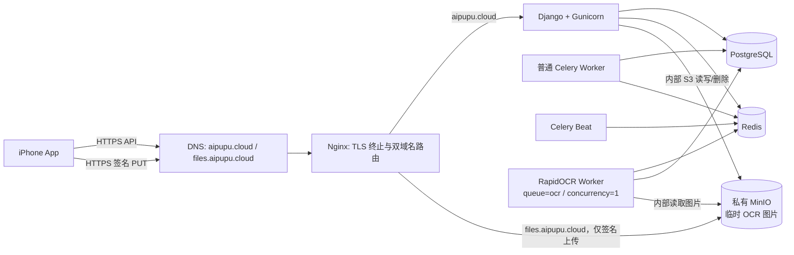

# 腾讯云 OCR 与 MinIO 单机整合设计

## 1. 目标与范围

本设计把已完成的腾讯云单机部署能力和自建药盒 OCR 能力整合到同一发布版本，在腾讯云 Lighthouse Ubuntu 服务器上运行 Django API、普通 Celery Worker、Celery Beat、RapidOCR Worker、PostgreSQL、Redis、MinIO 和 Nginx。

对外只提供两个 HTTPS 域名：

- `aipupu.cloud`：Django API。
- `files.aipupu.cloud`：iPhone 使用短期签名 URL 直接上传 OCR 图片。

MinIO API、MinIO Console、PostgreSQL、Redis、Django `8000` 和 Celery 均只存在于 Docker 私有网络，不发布宿主机端口。OCR 图片属于可丢弃的临时数据，不进入备份；确认成功后立即异步删除，未确认或失败任务按 24 小时保留目标清理。

本次不引入腾讯 COS、TKE、TencentDB、TCR、GPU、OCR 多并发、长期药盒原图或公网 MinIO Console，也不改变“所有 OCR 候选必须由用户确认后才能写入药箱”的产品边界。

## 2. 已有基线与整合方式

整合分支以腾讯云部署提交 `38021c4` 为基线，随后合入自建 OCR 提交 `cf24eba`：

- `38021c4`：腾讯云生产 Compose、Nginx/TLS、部署脚本、环境校验、备份恢复和生产设置。
- `cf24eba`：药盒拍照上传、OCR 任务/候选/确认 API、Flutter 页面、RapidOCR Worker、临时图片清理和测试。

两条分支共同修改了 `compose.yaml`、Django 设置、README 和设计文档，不能用“任选一边”的方式解决冲突。整合时以功能并集为目标：保留部署分支的生产安全约束，同时接入 OCR 分支的模型、迁移、API、Worker 和 Flutter 流程。生产差异继续集中在 `deploy/tencent/`，本地开发仍使用根目录 `compose.yaml`。

数据库迁移只有 OCR 分支新增的 medicines/OCR 初始迁移；发布前必须运行迁移漂移检查。任何合并冲突均在整合分支解决，不修改两个来源工作区。

## 3. 总体架构



公网安全组保持只开放 `22/80/443`。`22/tcp` 仅允许管理员当前公网 IP；`80/tcp` 只用于 ACME 验证和 HTTPS 跳转；`443/tcp` 承载 API 和签名上传。

## 4. 双端点对象存储设计

### 4.1 为什么必须使用两个端点

当前 OCR 分支只使用一个 `S3_ENDPOINT`。如果设为 `http://minio:9000`，API 生成的签名 URL 会包含 Docker 服务名，iPhone 无法访问；如果设为 `https://files.aipupu.cloud`，OCR Worker 的读取和删除又会绕公网 Nginx，增加故障面并削弱网络隔离。

整合后对象存储适配器使用两个明确端点：

| 配置 | 生产值 | 用途 |
| --- | --- | --- |
| `S3_INTERNAL_ENDPOINT` | `http://minio:9000` | API/OCR Worker 获取和删除对象 |
| `S3_PUBLIC_ENDPOINT` | `https://files.aipupu.cloud` | 仅用于生成交给 iPhone 的签名 PUT URL |

存储适配器内部建立两个 S3 client，但共用 bucket、region、path-style addressing 和应用凭据。`presign_put()` 使用 public client；`get_bytes()` 和 `delete()` 使用 internal client。签名固定使用 S3 Signature V4，签名 URL 有效期保持 600 秒。

为兼容本地开发，旧 `S3_ENDPOINT` 在一个过渡版本中仅作为 internal endpoint 的回退值；`S3_PUBLIC_ENDPOINT` 未设置时回退到 internal endpoint。生产环境校验禁止依赖回退，必须显式提供两个值。本地 iPhone 真机测试需要把 public endpoint 配成 Mac 局域网可访问地址，不能使用 `localhost` 或 `minio`。

### 4.2 请求约束

OCR 图片继续限制为 JPEG/PNG、单张不超过 8 MB、长边不超过 2048 像素；因此只使用单次 PUT，不启用 multipart upload。对象键格式保持 `ocr/tmp/<user-id>/<uuid>.<ext>`，不包含药名、用户名或其他敏感文本。

Nginx 代理签名请求时保留原始 `Host` 和完整 query string，否则 MinIO 会判定签名无效。`files.aipupu.cloud` 只允许上传所需的 `PUT` 请求，其他普通请求不转发到 MinIO。该 HTTPS server 关闭 access log，或使用明确排除 query string 的专用格式；签名、对象键和 OCR 原文不得写入访问日志或应用日志。

## 5. MinIO 服务与权限

### 5.1 容器和数据

MinIO 使用固定镜像版本和具名卷 `minio_data`。生产 Compose 清空基础 Compose 的 `9000/9001` 端口映射；Nginx 通过 Docker 网络访问 `minio:9000`，Console `9001` 不配置任何公网路由。

MinIO 健康检查通过后，幂等的 `minio-init` 一次性服务完成：

1. 创建私有 bucket `smart-reminder-private`。
2. 关闭匿名读取、写入和列表权限。
3. 创建独立应用用户并绑定最小策略，只允许目标 bucket 上的 `PutObject`、`GetObject`、`DeleteObject` 和必要的 bucket location 查询。
4. 设置 1 天对象生命周期规则，作为遗留/孤儿上传的兜底清理。

MinIO root 凭据只供初始化服务使用；Django 和 OCR Worker 使用独立的 `S3_ACCESS_KEY_ID` / `S3_SECRET_ACCESS_KEY`，不获得管理权限。两组凭据均只存在于权限为 `600` 的生产环境文件，不进入 Git、镜像、命令参数或日志。

### 5.2 数据持久性边界

MinIO 卷在容器重启和普通发布后保留，使正在处理的 OCR 任务可以恢复。该卷不进入 PostgreSQL 备份，也不复制到 COS。服务器磁盘损坏时允许丢失临时图片；数据库中的对应 OCR 任务应转为可重拍/可手动录入的失败状态，而不能生成未经确认的药品数据。

## 6. 图片生命周期

清理采用三层机制：

1. 用户确认候选后，事务提交成功立即派发 `delete_ocr_job_images`，优先删除两张原图。
2. Celery Beat 周期扫描已过期 OCR 任务，删除仍有对象键的图片；删除全部成功后才清空数据库中的对象键，失败则保留键以便重试。
3. MinIO bucket 的 1 天生命周期规则删除没有成功创建 OCRJob 的孤儿上传，并在应用清理不可用时提供最终兜底。

`OCR_JOB_RETENTION_HOURS=24` 表示正常服务下的保留目标，不是服务器断电期间仍可兑现的硬实时保证。确认图片通常在确认后几秒内删除；未确认任务在 24 小时后的下一次清理扫描删除；MinIO 生命周期由服务恢复后的扫描器执行。产品隐私说明应写成“通常在确认后立即删除，最迟按 24 小时保留策略自动清理；服务中断期间可能延迟到恢复后执行”，不能声称断电时仍能精确计时删除。

清理任务必须幂等：重复删除不存在的对象视为成功。部分删除失败时不能先清空全部对象键。日志只记录 job ID 和错误码，不记录对象键或签名 URL。

## 7. OCR Worker 生产配置

OCR Worker 使用独立镜像和 `ocr` 队列，普通 Worker 只消费 `celery` 队列，避免 API/普通 Worker 加载 RapidOCR 和 ONNX Runtime。

生产约束如下：

- `--concurrency=1`、`--prefetch-multiplier=1`。
- CPU 上限 `1.0`，内存预留约 `700 MB`，内存上限约 `1.2 GB`。
- 软超时 45 秒、硬超时 60 秒，最多重试 2 次。
- 使用固定版本 `RapidOCR 3.9.2 + ONNX Runtime 1.28.0`。
- OCR 模型随固定镜像/只读模型目录交付，Worker 启动时不得临时从公网下载模型。
- 发布后使用无敏感信息的仓库 fixture 执行一次真实模型 smoke test，只输出行数和耗时，不输出识别文本。

OCR 队列积压时不自动提高并发。先观察单任务耗时和服务器内存；只有 4 GB 服务器持续有足够余量且实际用户量需要时，才单独设计扩容。

## 8. DNS、TLS 与 Nginx

在 DNSPod 为 `files.aipupu.cloud` 新增 A 记录，记录值与根域名相同，TTL 使用 600。变更后必须从权威 DNS 和公共 DNS 验证解析，再申请证书。

首次 TLS 证书一次性包含两个 SAN：

- `aipupu.cloud`
- `files.aipupu.cloud`

Certbot 继续使用 webroot 验证；HTTP 启动配置只暴露两个域名的 `/.well-known/acme-challenge/`，其他路径不提供明文 API 或对象上传。正式 Nginx 配置包含两个 HTTPS server：API 域名代理到 `api:8000`；文件域名只代理受约束的签名 PUT 到 `minio:9000`。证书仍由 Certbot 定期续期，续期后必须先 `nginx -t` 再 reload。

文件域名的请求体上限设置为略高于应用单图上限，例如 9 MB；API 域名仍保持较小请求体限制。文件域名不提供目录页、Console、匿名 GET 或 bucket listing。

## 9. 生产环境契约

`deploy/tencent/env.production.example` 和环境校验器新增以下变量：

```dotenv
FILES_DOMAIN=files.aipupu.cloud
OCR_PROVIDER=rapidocr
OCR_STORAGE_PROVIDER=s3
OCR_JOB_RETENTION_HOURS=24
OCR_QUEUE=ocr
S3_INTERNAL_ENDPOINT=http://minio:9000
S3_PUBLIC_ENDPOINT=https://files.aipupu.cloud
S3_BUCKET=smart-reminder-private
S3_REGION=us-east-1
S3_ADDRESSING_STYLE=path
S3_ACCESS_KEY_ID=
S3_SECRET_ACCESS_KEY=
MINIO_ROOT_USER=
MINIO_ROOT_PASSWORD=
```

生产校验必须拒绝空的 MinIO root/app 凭据、非 HTTPS public endpoint、非 Docker 内部 MinIO internal endpoint、非 path addressing、相同的 root 与 app 用户，以及不匹配的 `FILES_DOMAIN`。校验输出只能列出缺失或无效的变量名，不能打印变量值。

现有尚未填写的 `DEEPSEEK_API_KEY` 和 `CERTBOT_EMAIL` 仍是部署前置条件。所有凭据在服务器上交互式填写或通过不回显的安全输入生成，不经聊天、Git 或部署日志传递。

## 10. 发布顺序

1. 合并并验证两个来源提交，保证整合分支工作区干净。
2. 在腾讯云新增并验证 `files.aipupu.cloud` DNS 记录。
3. 在服务器生产环境文件中安全补齐 DeepSeek、Certbot 和 MinIO 凭据，通过静态校验。
4. 签发同时包含两个域名的 TLS 证书。
5. 构建 API 与 OCR Worker 镜像，先启动 PostgreSQL、Redis、MinIO 和 `minio-init`。
6. 运行 Django 迁移，再启动 API、普通 Worker、OCR Worker 和 Beat。
7. API 健康后启动正式 Nginx；任何检查失败都不切换公网服务。
8. 执行内部 MinIO 检查、真实 RapidOCR smoke test、外部 HTTPS API 检查和完整 iPhone OCR 闭环。

部署脚本继续要求明确的完整 Git SHA 和干净工作区。构建失败不影响旧容器；迁移失败不启动新 API；OCR Worker 或 MinIO 失败时 API 健康检查可以区分“核心 API 在线”和“OCR 暂不可用”，客户端应允许重拍或手工录入。

## 11. 错误处理与回滚

- `files.aipupu.cloud` 未解析：不签发双域名证书，不向 iPhone 返回生产签名 URL。
- 签名上传返回 403：检查 public endpoint、Host 保留、服务器时间和凭据，不把签名 URL 写入日志。
- MinIO 不健康或初始化失败：不启动 OCR Worker，不创建公开文件路由。
- OCR 超时/崩溃：按既定退避最多重试 2 次，最终标记 `ocr_failed`，保留图片到清理策略执行。
- 清理失败：保留数据库对象键并重试；MinIO 生命周期继续兜底。
- 服务器资源不足：停止 OCR Worker，核心提醒 API 继续运行；不临时提高并发或取消内存限制。
- 新版本验收失败：恢复上一镜像和 Compose 配置；数据库迁移必须保持向后兼容。临时 MinIO 图片不参与版本回滚。

## 12. 测试与验收

### 12.1 自动化测试

- 存储单元测试分别断言签名 URL 使用 public endpoint，而读取/删除使用 internal endpoint。
- 环境测试覆盖双端点、两组不同凭据、文件域名和错误值拒绝。
- Compose 契约测试断言 `9000/9001` 无宿主机端口、OCR Worker 队列/并发/CPU/内存限制、MinIO 健康和初始化依赖。
- Nginx 契约测试断言双域名证书、API 路由、文件 PUT 路由、Host 保留、请求体限制和无 Console 路由。
- TLS/部署脚本测试断言两个证书域名、先初始化 MinIO、构建 OCR 镜像、运行迁移和健康门槛。
- OCR 保留测试覆盖确认后删除、过期扫描、部分删除失败、重复删除和孤儿对象生命周期配置。
- 完整后端测试、迁移漂移检查、Flutter analyze/test、Compose config、shell syntax 和 Nginx `-t` 全部通过。

### 12.2 服务器验收

- `https://aipupu.cloud/api/v1/health` 返回成功，HTTP 自动跳转 HTTPS。
- 两个域名的证书名称和有效期正确。
- 公网无法连接 `5432/6379/8000/9000/9001`，`files.aipupu.cloud` 无法匿名读取或列出对象。
- 签名 PUT 可以从 iPhone 上传，URL host 必须是 `files.aipupu.cloud`。
- OCR Worker 能通过内部 endpoint 读取图片并产生候选，用户确认后才创建药品库存。
- 确认后的对象被删除；构造过期任务后，清理任务能删除对象并清空对象键。
- 重启服务器后核心服务和 OCR 服务恢复，MinIO bucket 权限不变。
- PostgreSQL 备份仍可生成和恢复，备份中不包含 OCR 原图或 MinIO 凭据。

## 13. 完成标准

只有以下条件全部满足才认为整合上线完成：

- 部署和 OCR 两条分支功能均保留，所有自动化测试通过。
- MinIO 只在 Docker 私有网络内，应用使用非 root 最小权限凭据。
- iPhone 通过 HTTPS 签名 URL 上传，Worker 通过内部地址读取，二者不混用端点。
- OCR 候选必须人工确认，确认前不写药箱。
- 临时图片具有立即删除、周期清理和 bucket 生命周期三层机制，且不进入备份。
- 公网 API、文件上传、TLS、重启恢复和真实 OCR smoke test 均完成验收。
