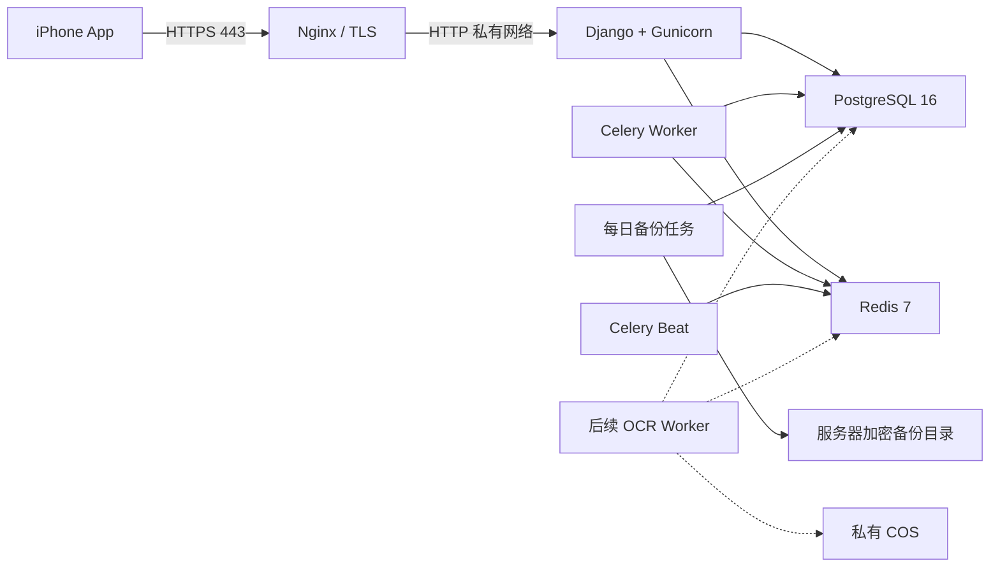

# 腾讯云单机预发布部署设计

## 1. 目标与范围

本设计把当前智能生活提醒后端部署到腾讯云单台 Ubuntu 服务器，并通过 `aipupu.cloud` 提供 HTTPS API，供 iPhone 真机和后续亲友内测使用。

首期部署现有 Django API、普通 Celery Worker、Celery Beat、PostgreSQL、Redis 和 Nginx。药品 OCR 正在独立分支开发，本部署不会修改 OCR 模块；OCR 合并后以额外 Worker 服务接入同一私有容器网络。MinIO 不进入首期公网部署，OCR 上线时使用私有腾讯云 COS。

首期不引入 TKE、自动扩缩容、TencentDB、TCR 自动发布或多机高可用。这些能力在亲友内测规模或可靠性要求形成实际需求后再增加。

## 2. 方案选择

采用单机 Docker Compose 方案：Nginx 负责公网入口和 TLS，应用组件运行在 Docker 私有网络中，PostgreSQL 数据存放在具名卷并进行每日备份。

选择这一方案的原因：

- 当前用户量和并发量低，单机资源足以承载提醒 MVP。
- 个人开发者可以用一套 Compose 配置完成部署、检查和回滚。
- 不依赖云厂商专有编排能力，后续可平滑迁移数据库、Redis 和镜像仓库。
- OCR 分支可以通过 Compose overlay 接入，不需要重写现有服务。

## 3. 部署拓扑

安全组只允许：

- `22/tcp`：仅管理员当前公网 IP。
- `80/tcp`：证书签发和跳转到 HTTPS。
- `443/tcp`：App API 公网访问。

PostgreSQL、Redis、Django 的 `8000` 端口和任何对象存储管理端口不得发布到公网。

## 4. 文件与服务边界

新增部署文件放在 `deploy/tencent/`，避免把生产差异混入本地开发配置：

- `compose.production.yaml`：生产 Compose overlay，关闭内部服务公网端口，增加 Nginx、健康检查、日志轮转和重启策略。
- `nginx/conf.d/aipupu.cloud.conf`：域名、反向代理、安全响应头和 ACME 路径。
- `env.production.example`：仅包含变量名和无敏感默认值，不包含任何真实密钥、IP、Token 或密码。
- `scripts/deploy.sh`：验证环境、构建镜像、迁移数据库、启动服务并检查健康状态。
- `scripts/backup-postgres.sh`：生成带时间戳的压缩数据库备份并清理过期文件。
- `scripts/restore-postgres.sh`：显式指定备份文件恢复，执行前要求人工确认。
- `README.md`：记录服务器初始化、首次发布、更新、回滚和故障排查步骤。

本地 `compose.yaml` 继续服务开发环境。生产启动命令同时加载基础 Compose 和生产 overlay，OCR 分支以后增加自己的 overlay 或向生产 overlay 添加独立服务。

## 5. 发布流程

### 5.1 首次服务器准备

1. 在开发机生成项目专用 Ed25519 SSH 密钥。
2. 用户通过腾讯云控制台把公钥加入服务器的 `ubuntu` 用户。
3. 验证密钥登录后禁用 SSH 密码登录，并更换已经暴露的初始密码。
4. 安装 Docker Engine、Compose Plugin、Nginx 容器所需目录和系统防火墙规则。
5. 把仓库检出到 `/opt/smart-reminder/app`，部署环境文件放在 `/opt/smart-reminder/shared/.env.production`，权限设为 `600`。

任何密码、DeepSeek Key、Django Secret、数据库凭据和证书私钥都不进入 Git、镜像层、命令参数、部署日志或 Flutter 包。

### 5.2 首次发布

1. 校验域名 A 记录指向当前服务器，并确认备案/访问条件。
2. 使用临时 HTTP 配置启动 Nginx，通过 Certbot Webroot 签发证书。
3. 构建应用镜像并启动 PostgreSQL、Redis。
4. 运行 Django 数据库迁移。
5. 启动 API、Worker、Beat 和 Nginx。
6. 从服务器内部检查 `/api/v1/health`，再从公网检查 `https://aipupu.cloud/api/v1/health`。

只有健康检查成功才认为发布完成。失败时保留上一版本容器和数据库卷，停止新版本并执行回滚。

### 5.3 日常更新

发布脚本接受明确的 Git 提交 SHA，不部署未提交工作区。更新过程依次执行：拉取目标提交、构建、迁移、启动、健康检查。应用镜像以提交短 SHA 标记，至少保留最近三个成功版本。

当前 Django 迁移应保持向后兼容。需要破坏性数据库变更时，必须拆成“先扩展、再切换、最后清理”多个版本，避免代码回滚后无法读取数据。

## 6. HTTPS 与域名

Nginx 终止 TLS 并代理到 `api:8000`。HTTP 请求统一 `301` 到 HTTPS；健康检查、API 请求体大小、代理超时和客户端真实 IP 通过明确配置控制。

证书使用 Let's Encrypt，Certbot 通过 Webroot 签发并由系统定时器续期。续期后执行 Nginx 配置检查和 reload。证书目录只挂载到 Nginx 和 Certbot，不挂载到 Django、Worker 或数据库。

Django 生产设置必须满足：

- `DJANGO_DEBUG=false`
- `DJANGO_ALLOWED_HOSTS=aipupu.cloud`
- `CSRF_TRUSTED_ORIGINS=https://aipupu.cloud`
- 正确识别 `X-Forwarded-Proto`，保证安全跳转和未来管理页面的 CSRF 校验。

## 7. 数据与备份

PostgreSQL 使用 Docker 具名卷。每日执行一次 `pg_dump` 自定义格式备份，文件保存在 `/opt/smart-reminder/backups/postgres`，仅 root 和部署用户可读。首期保留 14 天，并至少完成一次从备份恢复到临时数据库的演练。

同机备份不能防止整台服务器或磁盘损坏。亲友内测开始前，把备份加密后复制到私有 COS，或迁移到带自动备份的 TencentDB。

Redis 只承载 Celery 队列和短期状态，不作为唯一业务数据源。发布或故障恢复允许清空 Redis，但必须确保 Celery 任务幂等。

## 8. 可观测性与资源限制

Docker 日志采用 `json-file` 轮转，每个文件上限 10 MB，保留 5 个文件。应用日志不得包含 Bearer Token、DeepSeek Key、完整用户输入、完整模型响应、服务器密码或签名 URL。

首期至少监控：

- HTTPS 健康检查状态和证书到期时间。
- 主机磁盘、内存和负载。
- PostgreSQL 备份时间、大小和退出码。
- API 5xx 数量、Celery Worker 存活状态和队列积压。

PostgreSQL 和 Redis设置容器健康检查；API 只有在依赖健康后启动。所有长期服务使用 `restart: unless-stopped`。OCR 接入时单独限制 1 CPU、约 1.2 GB 内存和并发 1。

## 9. 错误处理与回滚

- 域名未解析：只完成服务器本地容器验证，不申请证书、不修改 App 生产地址。
- 证书签发失败：保持 HTTP 仅用于 ACME，不把未加密 API 暴露给 App。
- 构建失败：现有运行容器不变。
- 数据库迁移失败：停止新版本，不启动新 API，保留失败日志但不记录环境变量。
- 健康检查失败：恢复上一镜像标签并重新检查；数据库只在有明确恢复点时回滚。
- 磁盘空间不足：停止构建，清理未使用镜像前先列出目标；不得删除数据库卷或备份。

## 10. 验证标准

本地静态验证：

- `docker compose -f compose.yaml -f deploy/tencent/compose.production.yaml config --quiet`
- Shell 脚本通过 `bash -n`。
- Nginx 配置在容器内通过 `nginx -t`。
- 生产 Compose 不向宿主机发布 PostgreSQL、Redis 或 Django `8000`。
- 环境示例和 Git 历史不包含真实凭据。

服务器验收：

- SSH 密钥登录成功，密码登录关闭。
- `https://aipupu.cloud/api/v1/health` 返回成功状态。
- HTTP 自动跳转 HTTPS，证书域名和有效期正确。
- 重启服务器后容器自动恢复，健康检查成功。
- 数据库备份可生成，并能恢复到临时数据库。
- iPhone 使用 HTTPS API 创建并确认提醒，不再依赖局域网 HTTP。

## 11. 非目标与后续升级门槛

首期不部署 OCR、ASR、APNs 服务端推送、管理后台或公开注册。OCR 分支完成并通过本地烟雾测试后再接入；阿里云 ASR 和 APNs 各自使用独立设计与密钥边界。

出现以下任一情况时评估迁移 TencentDB、独立 Redis 或 TCR：数据库备份/恢复无法满足内测要求、单机内存持续超过 75%、发布构建影响线上请求、需要多台应用服务器，或开始公开测试。
