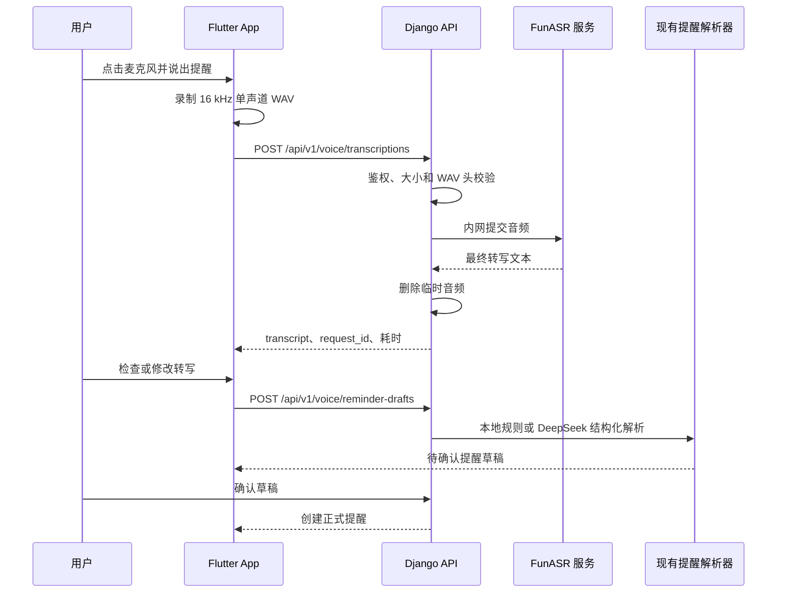

# FunASR 服务端语音识别设计

- 日期：2026-08-05
- 状态：方案已确认，待实施计划
- 适用阶段：iPhone 亲友内测 MVP
- 上位设计：`2026-08-03-smart-life-reminder-design.md`

## 1. 背景与决策

项目已经具备“文字转结构化提醒草稿、人工确认、创建正式提醒”的完整链路，`POST /api/v1/voice/reminder-drafts` 也已能接收外部转写文本。当前缺口是 Flutter 端采集音频，以及把音频可靠地转换成中文文本。

首版采用自建 FunASR 服务端识别：Flutter 录制短音频并上传 Django，Django 通过内部 `AsrProvider` 调用同一私有网络中的 FunASR 服务。首版使用非流式请求；实时增量转写属于后续独立阶段。

选择该方案的原因：

- FunASR 面向中文语音识别，支持 VAD、标点和热词，适合短提醒口令。
- App 不依赖云厂商 SDK、长期密钥或账号体系。
- Django 继续承担认证、限流、校验和审计，FunASR 不暴露公网端口。
- Provider 接口隔离推理服务，后续可以替换模型或增加云端兜底。
- 自建部署与现有 Docker Compose、腾讯云和自建 OCR 方向一致。

## 2. 目标与非目标

### 2.1 首版目标

- iPhone 用户点击麦克风，录制最长 20 秒的普通话提醒。
- App 上传单声道、16 kHz、16-bit PCM WAV 音频。
- Django 同步调用已预热的 FunASR 服务并返回最终转写。
- 用户可以修改转写文本，再进入现有提醒草稿与确认流程。
- 原始音频不进入对象存储或数据库；请求结束后立即删除临时文件。
- 识别失败不会创建提醒草稿或正式提醒，并允许用户重试或改用键盘。

### 2.2 首版不做

- WebSocket 流式音频和逐字增量转写。
- 后台长录音、会议转写、说话人分离或多语言自动检测。
- 端侧模型下载、离线识别或 iOS 原生 FunASR/ONNX 集成。
- 保存语音历史、回放原音或用用户录音训练模型。
- 通过语音直接删除、修改、停用提醒或确认服药状态。
- FunASR 不可用时自动把音频发送到第三方云服务。

## 3. 架构与数据流



FunASR 只负责音频转文字，不理解提醒意图、不访问数据库，也不能创建或执行提醒。提醒解析和权限边界继续由 Django 负责。

## 4. 组件边界

### 4.1 Flutter 录音组件

新增独立录音网关，封装 `record` 插件，不让页面直接依赖插件 API。组件负责：

- 请求和检查麦克风权限。
- 录制 16 kHz、单声道、16-bit PCM WAV。
- 显示 `idle`、`recording`、`transcribing`、`ready` 和 `error` 状态。
- 在 20 秒时自动停止；用户主动取消时删除本地临时文件。
- 上传成功或失败后删除本地临时文件。

麦克风入口放在现有文字提醒输入区域。识别完成后把 transcript 填入同一个可编辑输入框，由用户主动生成提醒草稿，不新增第二套草稿状态机。

### 4.2 Django 语音转写 API

新增认证接口：

```http
POST /api/v1/voice/transcriptions
Authorization: Bearer <token>
Content-Type: multipart/form-data

audio=<wav file>
```

成功响应：

```json
{
  "request_id": "uuid",
  "status": "completed",
  "transcript": "明天早上七点提醒我吃药",
  "audio_duration_ms": 3800,
  "transcription_latency_ms": 920,
  "provider": "funasr"
}
```

约束：

- 只接受 `audio/wav`，但不信任客户端 MIME，必须检查 RIFF/WAVE 头和 PCM 参数。
- 音频时长为 0.3 至 20 秒，请求体最大 2 MiB。
- 每个用户同一时间最多有一个识别请求；超过限制返回 `asr_busy`。
- 每个用户每分钟最多 10 次请求，每个 IP 每分钟最多 30 次请求。
- Django 调用 FunASR 的总超时为 20 秒。
- transcript 去除首尾空白后必须为 1 至 500 个字符。
- 转写没有持久化副作用，不缓存包含 transcript 的响应；网络失败后重试会重新执行推理。

稳定错误码包括 `microphone_audio_invalid`、`audio_too_short`、`audio_too_long`、`asr_busy`、`asr_timeout`、`asr_unavailable` 和 `empty_transcript`。格式和时长错误返回 400，空转写返回 422，并发或限流返回 429，服务不可用返回 503，超时返回 504。

### 4.3 ASR Provider

Django 业务层只依赖以下语义接口：

```python
class AsrProvider(Protocol):
    def transcribe(self, audio: BinaryIO, *, request_id: str) -> AsrResult: ...
```

`AsrResult` 包含 transcript、音频时长、推理耗时和 provider 名称。FunASR 特有的模型参数、响应字段和错误码只存在于 `FunAsrProvider` 内部，不泄漏到 API 或提醒领域层。

配置项：

- `ASR_PROVIDER=funasr`
- `ASR_BASE_URL=http://funasr:8000`
- `ASR_TIMEOUT_SECONDS=20`
- `ASR_MAX_AUDIO_BYTES=2097152`
- `ASR_MAX_DURATION_SECONDS=20`
- `ASR_CONCURRENCY_PER_USER=1`
- `ASR_USER_RATE=10/min`
- `ASR_IP_RATE=30/min`

### 4.4 FunASR 推理服务

FunASR 作为独立容器运行，只连接 Docker 私有网络，不映射公网端口。首版默认组合为：

- ASR：`paraformer-zh`
- VAD：`fsmn-vad`
- 标点：`ct-punc`
- 设备：CPU
- 服务并发：1

容器启动时加载并预热模型，健康检查只有在模型可接受请求后才成功。模型、FunASR 和运行时版本必须在依赖与镜像中固定，不能在线上启动时自动升级。模型文件放在持久化只读缓存卷中，生产环境不得在每次容器重启时重新下载。

热词首版只配置有限的提醒领域词，例如家庭成员称呼、常见药名和“工作日”“闹钟”“稍后提醒”；不得把完整家庭数据或健康备注同步到模型服务。

## 5. 隐私与安全

- Django 是唯一公网入口；FunASR 服务不接受公网连接。
- 音频只写入进程临时目录，不写数据库、COS、MinIO、日志或错误追踪附件。
- Django 在成功、失败、超时和客户端断开时都通过 `finally` 删除临时音频。
- 服务日志只记录 request ID、provider、音频字节数、时长、耗时和稳定错误码。
- 日志禁止记录音频、完整 transcript、FunASR 原始响应和用户健康信息。
- 现有提醒服务继续只保存 transcript 的 SHA-256 和结构化草稿。
- API 必须在读取完整请求体前执行认证和请求体大小限制，并对用户和 IP 限流。

## 6. 失败与降级

| 场景 | 用户体验 | 服务端行为 |
|---|---|---|
| 麦克风权限被拒绝 | 显示权限错误，保留文字输入 | 不发起请求 |
| 音频过短、过长或格式错误 | 提示重新录制 | 校验阶段拒绝，不调用 FunASR |
| FunASR 忙或不可用 | 显示可重试错误，保留文字输入 | 返回稳定错误码并删除临时音频 |
| 识别超时 | 允许重试或改用键盘 | 取消上游请求并删除临时音频 |
| 返回空文本 | 提示未听清 | 不创建草稿 |
| 识别文本有误 | 用户直接编辑 transcript | 只把修改后的文本提交给草稿接口 |
| 提醒解析有歧义 | 展示现有草稿歧义状态 | 未确认前不创建 ReminderRule |

首版不自动调用第三方 ASR 兜底，防止用户音频在未明确告知时离开自建环境。

## 7. 测试策略

### 7.1 Django

- WAV 校验单元测试：合法 PCM、错误 RIFF 头、错误采样率、立体声、时长上下界和请求体上限。
- Provider 契约测试：成功、空文本、超时、连接失败、非法响应和敏感日志检查。
- API 测试：未认证、限流、单用户并发、稳定错误码、重试重新推理和临时文件删除。
- 使用 fake provider 运行测试，普通 CI 不下载 FunASR 模型。

### 7.2 Flutter

- 录音状态机测试：授权、拒绝、开始、停止、自动超时、取消、上传和重试。
- Widget 测试：录音中禁用重复提交；识别成功填充可编辑文本；失败后保留键盘入口。
- iPhone 真机检查麦克风权限、来电或切后台中断、网络切换和本地临时文件清理。

### 7.3 集成验收

- 使用取得授权的 20 条普通话提醒录音，至少 18 条保留正确的提醒事项和时间关键词，并能生成预期草稿。
- 所有语音在人工确认前都不能增加 `ReminderRule` 数量。
- 对不超过 10 秒的录音，目标部署环境预热后的单并发 p95 转写时间不超过 5 秒。
- 连续执行成功、格式错误、超时和客户端取消用例后，临时目录中不存在遗留音频。
- FunASR 容器不开放宿主机公网端口，日志中不存在完整 transcript 或音频内容。

如果目标腾讯云 CPU 实例无法达到延迟指标，先增加实例 CPU/内存或选择更小的兼容中文模型；不得通过降低音频校验、隐私和人工确认要求来换取性能。

## 8. 发布顺序

1. 完成 FunASR 模型兼容性与 CPU 延迟验证。
2. 实现 Provider、音频校验和转写 API，使用 fake provider 完成自动化测试。
3. 在 Docker Compose 中加入只对内服务的 FunASR 容器并完成真实集成测试。
4. 接入 Flutter 录音与转写状态，将结果填入现有文字输入框。
5. 在 iPhone 真机运行授权语音集并记录准确率、延迟和失败原因。
6. 亲友内测稳定后，再为实时转写创建独立设计和实施计划。

## 9. 完成标准

首版在以下条件全部满足时完成：录音、上传、FunASR 转写、人工修改、现有草稿解析和确认链路可在 iPhone 真机闭环运行；自动化测试覆盖主要错误边界；原始音频在所有路径中被删除；目标环境达到验收延迟；任何转写都不能绕过现有人工确认机制。
