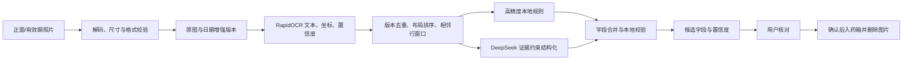

# 药盒 OCR 识别率增强设计

## 1. 背景与现状

2026-08-05 的 iPhone 真机测试证明图片上传、RapidOCR 和任务调度均正常。最近一次任务同时包含 `front`、`expiry` 两张图片，RapidOCR 返回 24 行文字，但结构化结果把“每片中左氧氟沙星含量0.5g”误判为药名，生产日期、有效期和批号均为空。其他任务还曾把“鼻喷雾剂”误判为药名。

根因不在上传或 OCR 任务失败，而在 OCR 后处理能力不足：

- 药名规则只检查是否包含“片、胶囊、喷雾”等剂型词，无法区分药名、成分说明和纯剂型。
- 日期规则要求标签与日期位于同一 OCR 行，只支持少量带分隔符的日期格式。
- 有效期喷码常见低对比度、反光和点阵字符，当前只缩放图片，没有针对日期区域增强。
- DeepSeek 当前只服务于提醒语义解析，没有参与药盒结构化。
- 生产日志只记录任务元数据，无法在图片删除前观察 OCR 原始行。

## 2. 目标

- 提高药名、规格、批号、生产日期和有效期的候选准确率。
- 支持标签与值分行、紧凑数字日期和常见中英文日期标签。
- 对有效期照片生成增强版本，提升低对比度喷码的可读性。
- 使用 DeepSeek 做有证据约束的字段判断，不允许模型编造 OCR 中不存在的值。
- DeepSeek 不可用、超时或返回非法结果时，OCR 任务仍使用本地规则成功完成。
- 增加默认关闭的 OCR 原文调试日志开关，便于短期排障。
- 保持用户确认后才入库、图片确认后删除、图片最多保留 24 小时的现有边界。

## 3. 非目标

- 不训练自有 OCR 或视觉大模型。
- 不根据药品知识推断图片中没有出现的生产日期、有效期或规格。
- 不自动跳过用户确认。
- 本阶段不接入国家药监局完整药品数据库，也不提供医疗建议。
- 不把图片、签名上传地址、Token 或 DeepSeek Key 写入日志。

## 4. 总体架构



流程继续在独立 `ocr-worker` 中执行。RapidOCR 是文字识别源，DeepSeek 只接收 OCR 文本、行编号、角色和置信度，不接收图片。

## 5. 图像与 OCR 层

### 5.1 图片版本

- 正面照片只使用现有的校验、缩放和 JPEG 规范化版本。
- 有效期照片同时生成两个版本：规范化彩色图和灰度增强图。
- 灰度增强使用 CLAHE 局部对比度增强和轻量锐化，不做可能破坏点阵字符的强二值化。
- 增强失败时保留规范化原图继续识别，增强版本不影响主流程可用性。
- 所有版本只存在任务内存，不写回 MinIO 或数据库。

### 5.2 多版本结果合并

- 每个版本分别调用 RapidOCR。
- 按规范化文字和文字框位置去重；同文同区域保留最高置信度，同文不同位置继续保留。
- 按文字框顶部坐标、左侧坐标排序，恢复稳定阅读顺序。
- `raw_line_count` 记录去重后的行数，避免增强版本重复放大统计。

## 6. 本地结构化规则

### 6.1 布局窗口

每条 OCR 行既作为单行候选，也与几何位置相邻的后续一行组成候选窗口。这样可解析：

```text
生产日期
2026 01 08
```

窗口只在同一照片角色内生成。同列上下窗口同时限制垂直距离和横向对齐，同排窗口限制垂直重叠和水平间距；每行分别保留最近的横向、纵向候选，避免双栏文字阻断正确日期窗口。

### 6.2 日期格式

支持以下有标签格式：

- `2026-01-08`、`2026/01/08`、`2026.01.08`、`2026年1月8日`
- `20260108`、`202601`
- 有效期使用的 `05/28`、`2028.05`
- `MFG`、`生产日期`、`生产日`、`EXP`、`有效期至`、`失效期`

紧凑数字日期只有在生产/有效期标签窗口中才可晋升为日期，防止把批号当日期。有效期只有年月时取该月最后一天；生产日期缺少日时保持为空，不猜测具体日期。生产日期晚于有效期时两个日期都留空；生产日期晚于任务当天时清空生产日期。已经过期的有效期必须保留，用于过期药品管理。

### 6.3 药名候选

- 只从正面照片选择药名。
- 排除包含“每片中、含量、成份、用法、批准文号、请仔细阅读”等说明句的行。
- 排除只包含通用剂型的短文本，例如“鼻喷雾剂”。
- 支持片剂、胶囊、颗粒、口服液、喷雾、注射液、滴眼液、混悬液、软膏、凝胶、栓剂和贴剂等家庭常见剂型后缀。
- 综合剂型后缀、文字长度、文字框相对面积和 OCR 置信度排序。
- 本地规则输出是 DeepSeek 失败时的可靠回退，不承担复杂语义判断。

## 7. DeepSeek 证据约束

DeepSeek 输入采用编号行，不包含图片和用户身份：

```json
{
  "front": [{"id": "front:0", "text": "...", "score": 0.98}],
  "expiry": [{"id": "expiry:0", "text": "...", "score": 0.95}]
}
```

输出字段为 `medicine_name`、`specification`、`batch_number`、`production_date_text`、`expiry_date_text` 和 `ambiguities`。每个非空字段必须携带 `line_ids`，并满足：

- 值必须是证据行原文的子串，或相邻证据行去空白后的连接结果。
- 日期只返回图片中的原始日期文字，本地代码负责解析和规范化。
- 无法确定时返回 `null` 并说明歧义，禁止补全或推断。
- 返回值必须通过严格 Pydantic Schema；未知字段、非法索引和无证据值按字段拒绝。

字段合并策略：

- 有效的 DeepSeek 药名覆盖本地药名，因为该字段需要语义判断。
- 规格、批号和日期优先使用本地高精度结果；本地为空时才使用通过证据校验的 DeepSeek 结果。
- DeepSeek 网络失败、超时、底层 I/O 错误、非法编码或响应非法时记录固定错误码并完全回退本地结果，不让 OCR 任务失败。

## 8. 调试日志与隐私

新增 `OCR_DEBUG_TEXT_LOGGING`，默认值为 `false`。

关闭时继续只记录：任务编号、耗时、去重行数、provider 和固定错误码。开启时额外逐行记录：

```text
ocr_text job_id=<uuid> role=expiry line=3 score=0.9821 text="有效期至2028.05"
```

日志实现必须：

- 把换行、制表符和其他控制字符替换为空格，防止日志注入。
- 单行最多保留 200 个字符。
- 不记录图片、对象键、上传 URL、请求头或模型凭据。
- 生产排障完成后关闭开关；已产生的原文仍按 journald 策略最多保留 7 天。

## 9. 数据与 API 兼容性

- 不持久化完整 OCR 原文，不新增保存原文的数据库字段。
- `OCRCandidate` 继续只保存候选字段、字段置信度和去重行数。
- Flutter 现有 OCR 查询与确认 JSON 契约保持不变。
- 本阶段不要求数据库迁移和 App UI 变更。

## 10. 错误处理

- 任一图片版本预处理失败：保留规范化原图结果；原图本身失败则沿用现有 OCR 重试。
- DeepSeek 未配置或不可用：使用本地规则，并记录不含 OCR 原文的固定回退日志。
- DeepSeek 返回无证据字段：只丢弃该字段，其他合法字段仍可使用。
- 生产日期晚于有效期：不自动交换，冲突字段保持为空并交给用户确认。
- 所有字段均为空：任务仍进入核对页面，允许用户手工录入。

## 11. 性能边界

有效期照片需要执行原图、增强图两次 RapidOCR。生产验收必须记录接近 8MB 上限的真机照片耗时，并与 45 秒软时限、60 秒硬时限比较。若余量不足，应在真实识别率样本上比较调整图片边长、任务时限或预处理策略，不能直接降低分辨率。

## 12. 测试与验收

- 单元测试覆盖日期分行、紧凑日期、年月有效期、过期日期保留、批号防误判、说明句、常见剂型和纯剂型防误判。
- 布局测试覆盖同文不同位置保留、跨栏拒绝以及横向文字不阻断纵向日期。
- 图像测试覆盖有效期双版本、正面单版本、增强失败回退和损坏图片错误码。
- DeepSeek 测试覆盖严格 JSON、证据索引、无证据拒绝、超时回退和敏感信息不进入异常。
- 日志测试覆盖默认不打印原文、开关开启后打印清理后的文本、最长 200 字。
- Job 测试覆盖多版本去重、语义覆盖药名、本地日期优先和模型失败不影响任务成功。
- 使用至少三类真实药盒验收：印刷日期、点阵喷码、标签与日期分行；每类都检查正面和有效期照片。
- 完成标准：不再把成分说明或纯剂型作为药名；可见且清晰的常见日期格式能进入候选；DeepSeek 不得产生任何 OCR 原文中不存在的值。
