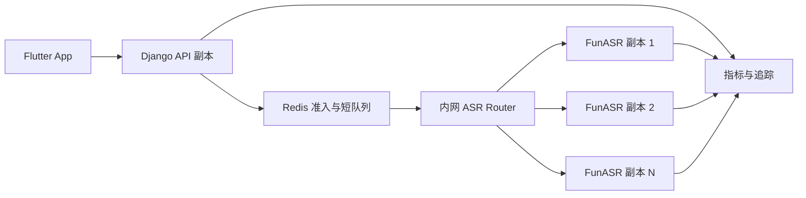

# 智能生活提醒 V2 提升路线图

- 日期：2026-08-05
- 最近更新：2026-08-07
- 状态：已确认的项目级后续事项清单
- 适用阶段：V1 亲友内测稳定后，至公开测试和早期公开版
- 上位设计：`2026-08-03-smart-life-reminder-design.md`
- 当前 V1 专项设计：`2026-08-06-typed-life-assistant-v1-design.md`

## 1. 文档目的

本文档集中记录 V1 之后已经确认需要提升的事项，避免语音、OCR、提醒、家庭、客户端和基础设施的后续决策散落在专项文档中。它是项目级路线图，不是可以一次执行的实施计划；进入某项工作前，仍需为该子项目建立独立设计、实施计划和验收记录。

V2 不改变产品安全边界：AI 和语音只能产生候选结果或提醒草稿，高风险数据必须人工确认，服务端权限与 Schema 校验不能被客户端或模型绕过。

## 2. V1 基线

V1 面向少量亲友和 iPhone 真机内测，目标是验证核心闭环，而不是提前承担公开产品的全部扩展成本。

V1 保留以下限制：

- 首轮只服务本人，家庭邀请、共享药箱、照护状态和跨成员通知延后到 V2。
- 产品验证聚焦周期用药、药品有效期和智能出门三个核心闭环。
- 只开放经过验证的官方工作流模板；开放式意图编排和更多生活模板延后到 V2。
- 外部执行只包括查询、提醒和打开深链接，不代替用户预约、购票、下单或支付。
- FunASR 单实例、全局单并发，使用 Redis 租约做非阻塞准入；忙时返回 `429 asr_busy`，不排队。
- RapidOCR 单 Worker、并发 1，避免在低配 CPU 实例上复制模型。
- iPhone 优先，旧系统使用本地通知降级；Android 不在 V1 验收范围内。
- PostgreSQL、Redis、Django、Celery、FunASR 和 OCR 可以在一台经过内存验证的主机上运行。
- 语音使用短音频非流式转写；不做实时增量转写、后台长录音或说话人分离。
- 服务端不长期保存原始语音、完整转写或默认 OCR 原图。

这些限制在亲友内测阶段是有意的范围控制，不视为缺陷。V2 是否启动由真实容量、可靠性、平台覆盖和公开发布需求触发。

## 3. V2 启动条件

满足以下任一条件时，开始对应 V2 子项目，而不是等待所有条件同时出现：

- 进入超过 20 名活跃测试用户的公开测试准备。
- ASR `asr_busy` 比例连续 15 分钟超过 1%，或转写 p95 连续 15 分钟超过 5 秒。
- OCR 等待时间 p95 超过 60 秒，或任务队列连续 10 分钟无法清空。
- 单机 CPU 连续 15 分钟超过 70%，或内存连续 15 分钟超过 80%。
- PostgreSQL、Redis、对象存储或备份需要独立故障域。
- Android 用户进入明确的内测名单。
- 需要 TestFlight 外公开分发、App Store 上架或国内 Android 渠道发布。

## 4. 优先级总览

| 优先级 | 子项目 | 进入条件 | 结果 |
|---|---|---|---|
| P0 | 账号、手机号升级、隐私与公开发布合规 | 公开测试前 | 基础手机号密码登录稳定，短信验证、找回、注销、导出和完整删除可用 |
| P0 | 备份、恢复、监控和生产隔离 | 公开测试前 | 数据可恢复，关键服务有 SLO、告警和回滚能力 |
| P0 | FunASR 与 OCR 容量扩展 | 达到容量阈值 | 多副本推理、受控准入、可测容量和无损扩容 |
| P1 | Android 客户端与厂商适配 | Android 内测名单确认 | 精确闹钟、通知权限和厂商后台策略通过真机矩阵 |
| P1 | 家庭权限与审计增强 | 家庭共享进入公开测试 | 字段级授权、关系解除、管理员访问审计和删除流程完整 |
| P1 | 提醒与通知可靠性增强 | 活跃提醒量增长 | 调度幂等、供应商降级、失败补偿和设备状态诊断 |
| P1 | 生活模板扩展 | 三个 V1 闭环稳定且出现重复用户需求 | 洗车、还款、买票、餐馆等场景复用同一组件内核 |
| P1 | 受控开放式意图编排 | 官方模板无法覆盖的有效请求持续出现 | 从模板匹配演进到 B+C，但仍只执行注册组件 |
| P2 | 实时语音和多 Provider | 非流式体验或单 Provider 成为瓶颈 | 可控的增量转写、灰度切换和质量对比 |
| P2 | OCR 模型与录入效率提升 | 真实药盒数据表明收益明确 | 连续扫描、模型评估和低置信度人工复核效率提升 |
| P2 | 确认后的外部提交 | 查询、提醒和深链接闭环稳定且有明确合作 API | 用户逐次确认后提交预约或购票，不开放自动支付 |

## 5. FunASR 可扩展性

### 5.1 V1 决策

- 只运行一个 FunASR 副本，每个副本并发 1。
- Django 在调用模型前获取带唯一持有者 token 和自动过期时间的 Redis 全局租约，不等待；租约已占用时返回 `429 asr_busy` 和 `Retry-After`，释放时校验持有者，避免旧请求释放新租约。
- 连接拒绝或容器未就绪返回 `503 asr_unavailable`；推理超过总超时返回 `504 asr_timeout`。
- 生产只接受 `8 <= ASR_TIMEOUT_SECONDS <= 20` 秒，Gunicorn 为 `30` 秒、Nginx 为 `35` 秒。HTTPX 阶段预算为连接 2 秒、连接池 1 秒、上传 4 秒和读取 `总预算-7` 秒，请求完成后再检查单调时钟总耗时。阶段预算解决每阶段重复完整超时的问题，但不是任意分块读取的数学硬截止，仍需保留 `ASR <= 20 < 30 < 35` 的外层余量。
- 生产默认 `OCR_ENABLED=false`；已认证用户访问所有 `/api/v1/ocr/*` 返回 `503 {"code":"ocr_disabled"}`，未认证请求仍由认证层优先返回 `401`，不得用功能开关泄露不同的认证行为。
- V1 不引入消息队列、Kubernetes、自动扩容或跨实例负载均衡。

### 5.1.1 腾讯单机首发容量记录

当前候选主机为 4 vCPU / 4 GB，FunASR 单进程、单并发，OCR 默认停用。以下字段必须在服务器首次真实模型发布后回填；本地静态测试和合成 WAV 协议测试不能替代这些测量。

| 测量字段 | 结果 | 采样条件 |
|---|---|---|
| 首次模型下载耗时 | 未采集 | 首次候选发布前模型卷已存在，不能从文件时间可靠反推出下载耗时；下次使用空卷时必须从 `funasr-model-init` 开始计时。 |
| 模型冷启动至 `/health` 就绪 | 约 71 秒 | 2026-08-07 已缓存模型重建容器；容器于 `19:24:36 +08:00` 启动，`19:25:40` 完成应用启动，`19:25:47` 首次健康探针成功。 |
| FunASR 稳定 RSS | `2.431 GiB` | 2026-08-07 `19:32:59 +08:00`，服务启动超过 8 分钟、空闲状态，`docker stats --no-stream`。 |
| 单次普通话请求峰值内存 | 至少 `2.43 GiB` | 2026-08-07 内网合成普通话 WAV 冒烟请求期间每秒采样；请求短于 1 秒级采样间隔，故此值是下限而非高精度峰值。 |
| `/v1/audio/transcriptions` 总耗时 | `3.05 秒` | 2026-08-07 同一合成普通话 WAV、并发 1；服务端日志记录 `time_escape=3.053`。 |
| 主机可用内存与 swap 压力 | 可用 `394 MiB`，swap 已用 `1.1 GiB / 1.9 GiB` | 2026-08-07 稳态采样；主机总内存 `3.6 GiB`，FunASR 容器内存上限 `2.539 GiB`，使用率约 `95.76%`。 |
| OOMKilled 与容器重启次数 | `false` / `0` | 2026-08-07 成功候选发布后的 `docker inspect`；本次未观察到 OOM。 |

本次测量已触发第 3 节的内存容量条件：单机稳态可用内存低于 20%，且 swap 持续占用。当前 4 GB 主机只允许保留 FunASR 单实例和普通 API/Worker；`OCR_ENABLED` 必须继续为 `false`。在开启 OCR、增加 ASR 并发、扩大内测用户或进行真实药盒 OCR 验收前，必须先升级内存或将 FunASR/OCR 拆分到独立内网实例，并重新采集空卷下载、冷启动、请求峰值和恢复数据。

若出现 OOM，只停止 FunASR 并恢复旧提交，保留 PostgreSQL、Redis、旧 API/Nginx 和模型卷。测量结果证明 4 GB 主机没有足够余量时，V2 优先增加内存或拆分推理实例，不提高单实例并发。

V1 单机发布门禁已经包括：按固定 revision 校验模型缓存 marker，缓存缺失时先停止旧推理再在同等资源限额内初始化；候选 API 在迁移和替换前探测 PostgreSQL、Redis 与 FunASR；生产 Nginx 配置在切换前由一次性容器校验；部署开始捕获旧 API/FunASR 镜像，受影响后的任一步骤失败统一先恢复 FunASR，再恢复已替换的 API/Worker，并保留原失败码。自动回滚不回退数据库迁移或模型卷，因此 V2 的一键回滚仍需落实向后兼容迁移检查、旧镜像与模型版本配套保留策略和真实回滚演练。真实 4 GB 容量、首次模型下载和重启恢复仍必须按上表在目标服务器测量。
### 5.2 V2 目标架构



V2 中 Django 保持无状态，音频仍不进入持久化队列。Redis 只保存不含音频和 transcript 的租约、等待令牌与短期状态。ASR Router 只把请求发给 readiness 成功且有空闲槽位的副本。

交互式语音不允许形成长队列：默认等待上限 2 秒、队列长度不超过可用副本数的 2 倍，超过上限返回 `429 asr_busy`。客户端按 `Retry-After` 提示重试，不自动无限重放音频。

### 5.3 容量与扩容

每种模型和实例规格都要用授权语音集单独压测。容量估算使用：

```text
所需副本数 = ceil(峰值请求率 × p95 推理秒数 ÷ 每副本并发 ÷ 0.70)
```

扩容依据包括到达率、准入拒绝率、等待时间、推理时间、CPU、常驻内存、容器重启次数和模型加载时间。单副本目标利用率不超过 70%，保留一个副本故障时的降级余量。

先使用 Docker Compose 多副本和内网负载均衡；只有发布并发、节点隔离或自动扩容确实超过单机能力后才评估 TKE/Kubernetes。不得把 Kubernetes 本身当作 V2 完成标准。

### 5.4 质量与发布

- 固定 FunASR、模型 revision、运行时和模型权重许可证。
- 记录 CER、提醒事项/时间关键词保留率、p50/p95/p99 延迟和 `asr_busy` 比例。
- 新模型或新副本配置先在脱敏录音集离线对比，再灰度到少量用户。
- 扩容不得改变原始音频即时删除、完整 transcript 不进日志和人工确认要求。
- 保留上一版本镜像与模型缓存，出现准确率或稳定性回退时可以快速回滚。

## 6. 客户端与平台

### 6.1 Android 第二阶段

- 接入 Android AlarmManager、精确闹钟权限和通知渠道。
- 覆盖 Pixel/AOSP、华为、小米、OPPO 和 vivo 的真机或云真机矩阵。
- 为电池优化、后台限制、自启动和通知权限提供设备状态诊断。
- 推送采用厂商通道作为辅助，本地精确闹钟仍是核心提醒保障。

### 6.2 iPhone 公开版

- iOS 26+ 使用 AlarmKit，旧系统保留本地通知降级并明确能力差异。
- 覆盖通知权限变更、设备重启、时区变化、夏令时和系统升级场景。
- 补齐 Apple 登录、账号注销、隐私标签和审核演示流程。

## 7. 账号、隐私与合规

### 7.1 V1.5 手机号密码基线

手机号密码登录先作为亲友内测基础能力实施，专项设计见[手机号密码登录注册设计](2026-08-06-phone-password-auth-design.md)。该阶段的已确认边界为：

- 只支持中国大陆 `+86` 手机号，App 输入 11 位号码，服务端规范化为 E.164 格式。
- 使用手机号和密码开放注册，不要求邀请码；没有短信验证时账号明确标记为 `phone_verified=false`。
- 使用 15 分钟 Access Token 和 30 天 Refresh Token，支持轮换、黑名单、多设备登录和当前设备退出。
- App 使用 iOS Keychain 保存令牌，不再把用户 Token 编译进生产安装包。
- 修改密码和管理员重置密码后撤销全部旧 Refresh Token；忘记密码暂由管理员交互式重置。
- 原 `iphone-test` 数据不迁移，新注册账号从空数据开始。
- 服务器在迁移窗口兼容旧 DRF Token，待测试用户全部升级后再单独删除兼容路径。
- 开放注册按 IP 和手机号限流，但不能证明号码所有权；手机号被抢先注册是短信接入前的已知风险。

这套基线必须先通过注册、登录、自动刷新、并发刷新、修改密码、多设备、退出和数据隔离验收，再进入短信升级。手机号密码基线本身不等待 V2 全部能力完成。

### 7.2 V2 手机号升级

V2 把“未验证手机号标识”升级为真正的号码所有权验证，而不是另建一套账号体系：

- 接入国内短信 Provider，支持注册验证码、补验证和短信找回密码。
- 验证码只保存带用途和有效期的摘要，限制发送频率、验证次数、手机号、IP 和设备维度。
- 短信发送成功不代表注册成功；注册事务仍由服务端唯一约束和幂等键保证。
- 为 V1.5 未验证账号提供补验证流程；号码已被未验证账号占用时进入受控申诉，不自动覆盖原账号数据。
- Provider 超时或不可用时显式提示，不能绕过验证直接把账号标记为已验证。
- 建立短信费用、发送成功率、验证码失败率、异常地区和批量注册告警。
- 保留手机号密码登录，短信验证码登录是否开放由真实用户需求和风险评估决定。

### 7.3 公开发布账号能力

- 增加 Apple 登录，并与已有手机号账号进行明确的绑定或合并确认，禁止仅凭同名信息自动合并。
- 提供设备会话列表、指定设备退出和全部设备退出。
- 提供账号注销、数据导出、家庭关系解除和完整删除流程。
- 敏感个人信息单独同意，第三方 SDK、短信、模型、推送和对象存储用途可追溯。
- 公开版准备隐私政策、用户协议、软件著作权、ICP备案和应用市场材料。
- 管理员默认不能查看健康备注原文；所有必要访问和账号恢复操作都要记录审计事件。
- 数据删除覆盖 PostgreSQL、Redis、对象存储、短信 Provider 标识、备份保留策略和其他外部 Provider。

## 8. 基础设施与可靠性

- PostgreSQL 和 Redis 从单机容器迁移到独立实例或 TencentDB，并完成白名单和最小权限配置。
- 建立每日加密备份、定期恢复演练、迁移前校验和明确的 RPO/RTO。
- Django API、Celery Worker、FunASR 和 OCR Worker 使用独立健康检查、资源限额和重启告警。
- CI/CD 增加依赖与镜像扫描、数据库迁移检查、灰度发布和一键回滚。
- 公网只开放 HTTPS；数据库、Redis、FunASR、OCR Worker 和管理端口保持私网访问。
- 建立关键 SLO：API 可用性、提醒准时率、ASR 延迟/拒绝率、OCR 完成率和推送失败率。

## 9. 提醒与通知

- V1 已提供单机亲友内测所需的调度幂等、Provider 显式降级、通知 Outbox、本地通知兜底和设备诊断基线；本节只描述公开版、多设备和更高容量下的增强，不重复计入 V1 完成度。
- 调度、通知发送和用户动作保持幂等，重复任务不能生成重复通知或状态记录。
- 天气、节假日和推送 Provider 支持超时、缓存、熔断和显式降级。
- 把 V1 单设备诊断扩展为多设备送达诊断，覆盖权限、设备 token、后台限制、时区、系统能力和设备撤销状态。
- 工作日历按年度版本发布并保留变更审计，调休数据由管理员复核。
- 只有在普通通知和重要通知闭环稳定后，才扩展家庭升级通知与跨成员提醒。

## 10. 家庭药箱与 OCR

- OCR Worker 根据队列和内存指标扩展为受控 Worker 池，每个进程只加载一份模型。
- OCR 原图继续使用私有对象存储和生命周期规则，确认后优先删除。
- 连续扫描、批量确认和低置信度筛选以减少大量药品录入成本。
- 云 OCR 只能作为显式配置的 Provider 备选，不得在未告知用户时上传图片。
- 家庭药箱完善字段级共享、成员移除、库存并发更新和管理员审计。
- OCR 和模型输出仍是候选值，不能直接创建用药计划、修改剂量或丢弃药品。

## 11. 产品、发布与运营

- 建立 TestFlight、Android 内测、公开测试和正式版四级发布通道。
- 准备商店截图、审核账号、隐私说明、客服入口和数据删除入口。
- 建立崩溃、服务异常、任务积压、安全事件和供应商到期的响应流程。
- 通过真实家庭访谈和内测指标决定功能优先级，不因技术可实现就进入 V2。
- 每个 V2 子项目必须记录负责人、进入条件、设计文档、验收结果和回滚方式。

## 12. 智能助手、家庭与工作流扩展

### 12.1 家庭协作

- 增加家庭邀请、关系解除、个人药箱和共享药箱边界。
- 支持用户明确授权家人查看服药完成状态，不默认共享疾病备注、用量文字或完整历史。
- 支持代录药品、共享批次和跨成员升级提醒，每类动作分别定义权限和审计事件。
- 家庭管理员不能绕过本人授权修改用药计划、用量或敏感提醒。
- V1 数据模型只预留个人 `owner`；进入本项目时必须建立独立权限与迁移设计。

### 12.2 更多官方模板

在三个 V1 闭环稳定后，按真实用户频率依次评估：

- 洗车：计划时间前查询未来数日降雨，提示执行或改期。
- 信用卡还款：每月账单日和还款日周期提醒，支持手工标记已还。
- 节前买票：按目标节日、预售规则和是否已购票形成提醒。
- 餐馆筛选：根据地点、时间、人数和用户偏好生成候选，并打开对应 App。
- 更多日历增强：会前准备、跨地点缓冲和连续行程冲突提示。

新模板仍必须使用注册组件、Pydantic Schema、权限策略、幂等执行和显式降级，不能因场景增多引入任意脚本。

### 12.3 受控开放式意图编排

产品长期方向为 B+C：用户可以自由表达生活目标，模型从已验证组件中组合候选工作流，健康和药品能力继续作为高可靠垂直领域。

进入条件：

- 官方模板无法覆盖的有效请求连续四周超过创建请求的 10%。
- Component Registry 至少有三个独立业务模板复用同一批组件，并具备稳定的输入输出 Schema。
- 编译器拥有完整的类型检查、环检测、权限检查、成本上限和执行步数上限。
- 离线评测集覆盖意图识别、组件选择、必填字段、越权请求和提示注入。

开放式编排仍只生成候选 `TaskSpec`。模型不能创造组件、URL、代码或数据库动作，也不能改变运行时策略。无法编译时回到追问或结构化表单，不允许模型临场自由执行。

### 12.4 外部操作

- 第一阶段只评估有正式 API、结果可查询且支持幂等的预约或购票 Provider。
- 每次提交前展示对象、时间、价格、身份信息和取消规则，并要求用户逐次确认。
- Provider 返回不确定结果时进入“待核对”，不能自动重试可能产生重复订单的请求。
- 支付、一次授权后的自动交易和绕过第三方确认页面不进入已确认范围。

### 12.5 框架进入条件

- `pgvector`：模板超过 30 个，规则召回无法稳定取得候选，且离线评测证明向量检索有明确收益。
- `CEL`：用户需要组合官方模板未覆盖的条件，且类型化判别联合类型产生明显维护重复。
- `Temporal`：出现跨天等待、补偿事务、人工审批恢复点或 Celery 状态恢复已经成为主要故障来源。
- `LangGraph`：仅用于非关键规划实验；不得替代确定性编译器、Policy Gate、Scheduler 或 Runner。
- 任一框架引入前必须建立独立设计、迁移、容量、回滚和故障降级方案。

## 13. 明确排除

以下事项不因进入 V2 自动恢复为需求：

- AI 自动诊断、处方建议或剂量推荐。
- 保险、在线问诊、药品销售和处方流转。
- 未经确定性策略验证，或在需要 TrustGrant 时缺少有效授权，直接执行语音指令或模型输出。
- 默认长期保存原始语音、完整转写或 OCR 原图。
- 在没有真实容量瓶颈时引入 Kubernetes、复杂事件总线或长期音频队列。
- 自动识别中药处方中每味饮片并直接生成用药方案。

## 14. 路线图维护规则

- 新的后续事项先判断是否属于已有 V2 子项目，避免重复文档。
- 只有已确认的产品或技术决策才能进入本路线图；未验证想法进入独立调研记录。
- 每次 V1 范围调整、公开发布决策或容量事故后复查本路线图。
- 完成的事项从路线图链接到对应设计、计划和验收记录，不直接删除历史决策。
- 本文档与专项设计冲突时，以日期更新且范围更具体的已批准设计为准，并同步修正文档链接。
