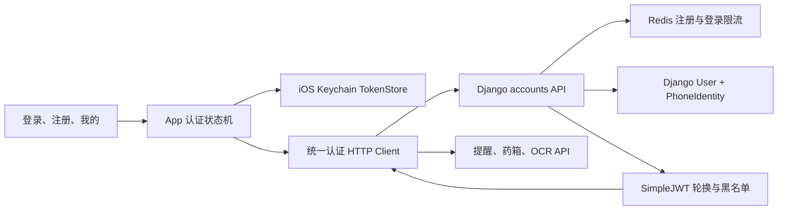

# 手机号密码登录注册设计

## 1. 背景

当前 App 通过编译参数 `API_ACCESS_TOKEN` 固化一个 DRF Token。后端已经使用 Django 用户和 `request.user` 隔离提醒、药箱与 OCR 数据，但没有注册、登录、退出、令牌刷新、密码修改或安全的客户端令牌存储。继续分发同一个安装包会导致所有测试者共享同一账号和数据，并把长期 Token 放进可提取的 App 二进制。

本阶段为亲友内测增加中国大陆手机号加密码的账号闭环。手机号注册暂不接短信验证码，注册后明确保存为未验证状态。服务端先兼容旧版固定 Token，待新版 App 完成迁移后再单独移除兼容路径。

## 2. 已确认决策

- 账号使用中国大陆 `+86` 手机号和密码。
- App 输入 11 位大陆手机号，服务端规范化为 `+86xxxxxxxxxxx`。
- 首版开放注册，不要求邀请码；未验证手机号可能被抢先注册是已接受的阶段性风险。
- 首版不迁移 `iphone-test` 的提醒、药箱或 OCR 数据，新账号从空数据开始。
- 同一账号允许多设备同时登录，每台设备拥有独立刷新令牌。
- 忘记密码暂由管理员通过交互式服务器命令重置。
- 认证使用 JWT Access Token 和 Refresh Token。
- 本阶段包含登录、注册、登录态恢复、自动刷新、退出、个人页和修改密码。

## 3. 目标

- 用户可以在 App 内使用手机号和密码完成注册及登录。
- 用户令牌存入 iOS Keychain，不再编译进生产安装包。
- Access Token 过期后 App 可以安全地自动刷新并重试原请求。
- 多个并发请求只能触发一次刷新，避免刷新令牌轮换冲突。
- 用户可以查看自己的脱敏手机号、修改密码和退出当前设备。
- 修改或管理员重置密码后，所有旧 Refresh Token 失效。
- 现有提醒、药箱和 OCR 接口继续按 `request.user` 隔离数据。
- 旧版 App 在迁移窗口内仍可使用原 DRF Token。

## 4. 非目标

- 不发送短信验证码，不验证手机号所有权。
- 不实现短信找回密码、Apple 登录或第三方登录。
- 不实现账号注销、数据导出或设备会话列表；账号注销在正式 App Store 发布前补齐。
- 不迁移或合并 `iphone-test` 数据。
- 不实现家庭成员邀请和家庭共享。
- 不在本阶段移除旧 DRF Token 兼容。
- 不解决 `aipupu.cloud` 的 ICP 备案或蜂窝网络连通问题；认证功能发布前仍需完成该基础设施事项。

## 5. 总体架构



后端新增独立 `accounts` 模块，负责手机号身份、认证 API、令牌签发、密码操作、限流和管理员重置。现有业务模块不直接依赖手机号，只继续依赖 Django 用户和 `request.user`。

Flutter 新增认证领域层和统一认证 HTTP Client。根组件根据认证状态展示启动页、登录注册页或主界面。现有四类 API Client 通过统一 HTTP Client 获取认证能力，不各自保存固定 Token。

## 6. 后端数据模型

### 6.1 保留 Django User

不在已经部署迁移后更换 `AUTH_USER_MODEL`。注册事务创建默认 Django User：

- `username` 保存规范化后的 `+86` 手机号。
- `email` 保持空值。
- 密码使用 Django 密码散列接口写入，不自行实现哈希。
- `is_active` 控制账号是否允许登录。

### 6.2 PhoneIdentity

新增 `accounts.PhoneIdentity`：

| 字段 | 类型 | 约束 |
|---|---|---|
| `user` | OneToOneField | 主键，级联删除 |
| `phone_e164` | CharField(16) | 唯一、索引，只保存 `+86` 规范格式 |
| `phone_verified` | BooleanField | 默认 `false` |
| `created_at` | DateTimeField | 自动创建 |
| `updated_at` | DateTimeField | 自动更新 |

`User.username` 与 `PhoneIdentity.phone_e164` 在注册事务中写入同一值。双重唯一约束提供并发保护；所有登录查询以 `PhoneIdentity.phone_e164` 为入口。后续变更手机号时必须在单一事务内同时更新两处。

### 6.3 JWT 黑名单

启用 `rest_framework_simplejwt.token_blacklist` 的迁移与模型，用于追踪 Outstanding Token 和 Blacklisted Token。不新增自研明文令牌表。

## 7. 手机号与密码规则

App 只接受 11 位数字。服务端去除首尾空白后要求匹配 `1[3-9]\d{9}`，随后转换为 `+86` 加 11 位号码。服务端拒绝其他区号、分隔符和任意宽松猜测，避免客户端与服务端规范化不一致。

密码长度为 8 到 64 个字符，并调用 Django 密码验证器拒绝：

- 与手机号过度相似的密码。
- 常见弱密码。
- 纯数字密码。

密码字段只接受 JSON 字符串，不做日志记录，不在异常消息中回显。

## 8. 令牌与认证兼容

### 8.1 JWT 生命周期

- Access Token：15 分钟。
- Refresh Token：30 天。
- 开启 Refresh Token 轮换。
- 每次成功刷新后拉黑旧 Refresh Token。
- Access Token 只用于业务 API，不持久化到服务端会话表。

多设备登录会生成不同的 Refresh Token。退出只拉黑当前设备提交的 Refresh Token。修改密码和管理员重置密码会拉黑该用户所有尚未失效的 Refresh Token；已经签发的 Access Token 最多继续存活 15 分钟。修改密码成功后为当前设备签发一套新令牌。

### 8.2 旧 DRF Token 兼容

新建组合 Bearer 认证器：

- 含两个 `.` 分隔符的 Bearer 值按 JWT 校验。
- 其他 Bearer 值交给现有 DRF Token 校验。
- 两种路径都只把认证后的 Django User 交给业务接口。
- 非法 JWT 不得退回 DRF Token 查询，避免降级绕过。

兼容认证器只用于受保护业务 API。注册、登录和刷新接口显式允许匿名访问并使用各自的限流规则。旧版迁移结束后另立变更删除 DRF Token 路径和相关生产 Token。

## 9. API 设计

所有接口使用 JSON。令牌字段命名保持统一：`access_token`、`refresh_token` 和 `access_expires_in`。

### 9.1 注册

`POST /api/v1/auth/register`

请求：

```json
{
  "phone": "13800138000",
  "password": "example-password",
  "password_confirm": "example-password"
}
```

成功返回 `201`，包含用户摘要和一套令牌。注册在数据库事务内完成；重复手机号返回 `409 phone_already_registered`。密码不一致或不符合规则返回 `400` 和稳定字段错误码。

### 9.2 登录

`POST /api/v1/auth/login`

请求包含 `phone` 和 `password`。成功返回 `200`、用户摘要和一套令牌。不存在的手机号、错误密码和停用账号统一返回 `401 invalid_credentials`，不泄露账号状态。

### 9.3 刷新

`POST /api/v1/auth/refresh`

请求包含当前 `refresh_token`。成功返回新的 Access Token 和轮换后的 Refresh Token。过期、已拉黑或被重放的 Refresh Token 统一返回 `401 invalid_refresh_token`。

### 9.4 退出

`POST /api/v1/auth/logout`

请求需要有效 Access Token，并提交当前设备的 Refresh Token。服务端只允许拉黑属于当前用户的令牌，成功和已经拉黑都返回 `204`，保持幂等。

### 9.5 当前用户

`GET /api/v1/auth/me`

返回：

```json
{
  "id": "user-id",
  "phone_masked": "138****8000",
  "phone_verified": false
}
```

接口不返回完整手机号。

### 9.6 修改密码

`POST /api/v1/auth/password/change`

请求包含 `current_password`、`new_password` 和 `new_password_confirm`。成功后拉黑全部旧 Refresh Token并返回当前设备的新令牌。当前密码错误返回 `400 current_password_invalid`。

## 10. 限流与审计边界

生产环境使用现有 Redis 的独立逻辑数据库作为 Django Cache；测试使用独立 LocMem Cache。限流键中的手机号使用 `DJANGO_SECRET_KEY` 派生的 HMAC，不把完整手机号写入 Redis 键或日志。

- 注册：同一 IP 每小时最多 5 次；同一手机号每天最多 3 次尝试。
- 登录失败：同一 IP 与手机号组合 15 分钟最多 5 次，同一 IP 每小时最多 30 次；成功登录后清除对应组合的失败计数。
- 刷新接口同一 IP 每 5 分钟最多 30 次，防止批量令牌探测。
- 超限返回 `429 rate_limited` 和可重试秒数。

日志允许记录事件码、用户内部 ID、手机号掩码、限流维度哈希前缀和结果，不记录密码、完整手机号、Authorization、Access Token 或 Refresh Token。

开放注册且没有短信验证时无法证明号码所有权。该风险必须在设计和内测说明中保留；接入短信后，注册流程改为验证码验证，并为现有未验证账号设计申诉或补验证流程。

## 11. 管理员密码重置

新增生产可用管理命令，按规范化手机号查找用户。命令通过 `getpass` 交互式读取并二次确认新密码，不接受命令行明文密码参数，不输出密码。密码通过同一验证器后写入，并拉黑该用户全部 Refresh Token。命令日志只记录用户内部 ID 和固定完成事件。

## 12. Flutter 架构

### 12.1 配置与安全存储

生产 `AppConfig` 只读取 `API_BASE_URL`。移除生产对 `API_ACCESS_TOKEN` 的依赖。新增 `TokenStore` 接口和基于 `flutter_secure_storage` 的实现，把 Access/Refresh Token 保存到 iOS Keychain。测试使用内存实现，不访问真实 Keychain。

### 12.2 认证状态机

根状态只有三类：

- `booting`：读取 Keychain，并使用 `/auth/me` 或刷新恢复会话。
- `unauthenticated`：展示登录注册页。
- `authenticated`：构造带认证的 API Client 并展示主界面。

启动恢复失败、Refresh Token 无效或账号停用时清空 Token 并进入登录页。普通网络暂时不可用时不把令牌判定为无效；App 展示可重试的连接错误。

### 12.3 统一认证 HTTP Client

统一 Client 负责：

1. 从 TokenStore 读取 Access Token并添加 Bearer 头。
2. 收到 `401` 后进入单飞刷新：同一时刻最多一个刷新请求。
3. 刷新成功后原子写入新令牌，并让等待请求使用新 Access Token 各重试一次。
4. 刷新失败时通知根认证状态清除登录态。
5. 不对注册、登录、刷新请求递归应用自动刷新。

业务 API Client 继续负责各自的 URI、JSON 和领域错误，不再持有固定字符串 Token。

## 13. Flutter 界面

### 13.1 登录注册页

使用“登录 / 注册”分段控件切换，不使用嵌套卡片。

- 登录：手机号、密码、提交按钮。
- 注册：手机号、密码、确认密码、提交按钮。
- 手机号键盘使用数字类型，密码支持显示/隐藏图标。
- 注册成功直接进入主界面。
- 字段错误显示在对应输入框附近；网络和服务错误显示页面级可重试提示。

### 13.2 我的

主导航新增第四个“我的”入口，包含：

- 脱敏手机号。
- “手机号未验证”状态。
- 修改密码命令入口。
- 退出登录按钮。

修改密码页要求当前密码、新密码和确认密码。退出登录先尝试服务端拉黑当前 Refresh Token，然后无条件清除本地令牌并回到登录页。

## 14. 错误处理

后端返回稳定的机器错误码，Flutter 映射为中文提示：

| 错误码 | App 行为 |
|---|---|
| `invalid_phone` | 标记手机号字段 |
| `weak_password` | 展示密码规则问题 |
| `phone_already_registered` | 提示直接登录 |
| `invalid_credentials` | 登录页通用错误 |
| `rate_limited` | 暂时禁用提交并显示稍后重试 |
| `invalid_refresh_token` | 清空登录态并回登录页 |
| 网络失败 | 保留输入和登录态，允许重试 |

服务器异常和解析异常不向用户显示内部堆栈或响应原文。App 不因 `/auth/me` 的暂时网络失败删除有效 Refresh Token。

## 15. 测试

### 15.1 后端

- 手机号格式、规范化、唯一约束和并发注册。
- 密码确认、长度、常见密码、纯数字和相似信息校验。
- 注册、登录、停用账号、错误凭据和返回字段最小化。
- 注册、登录和刷新限流；缓存键不含完整手机号。
- Access Token 有效与过期行为。
- Refresh Token 轮换、黑名单和旧 Token 重放拒绝。
- 多设备同时登录与单设备退出。
- 修改密码和管理员重置后撤销全部 Refresh Token。
- 组合 Bearer 认证器对 JWT、旧 DRF Token 和非法值的处理。
- 现有提醒、药箱和 OCR API 的匿名拒绝与用户隔离回归。
- 日志中不存在密码、完整手机号和令牌。

### 15.2 Flutter

- 启动时无令牌、有有效令牌、需刷新、网络失败和刷新失败状态。
- 登录与注册字段校验、加载、成功和错误状态。
- SecureTokenStore 读写和清除契约。
- 多请求并发 `401` 只刷新一次，轮换结果原子保存。
- 刷新后原请求只重试一次，避免无限循环。
- 修改密码后替换令牌。
- 退出无论服务端成功或网络失败都清除本机令牌。
- 我的页面显示脱敏手机号和未验证状态。
- 现有提醒、药箱、拍照录入和本地通知回归测试。

## 16. 发布与迁移

1. 备份 PostgreSQL，并执行 `accounts` 与 SimpleJWT 黑名单迁移。
2. 先部署兼容 JWT 和旧 DRF Token 的后端。
3. 验证旧版 App 的提醒、药箱和 OCR 仍可访问。
4. 构建不含 `API_ACCESS_TOKEN` 的新版 App，在 iPhone 注册新手机号账号。
5. 验证重启恢复、令牌刷新、修改密码、多设备和退出。
6. 通过 TestFlight 分发新版；旧 `iphone-test` 数据继续保留但不迁移。
7. 当活跃测试者全部升级后，另立任务删除旧 DRF Token 认证和生产测试 Token。

蜂窝网络验收依赖 `aipupu.cloud` 完成 ICP 备案或迁移到不要求大陆备案的部署区域。认证实现完成不代表该网络阻塞已解决。

## 17. 完成标准

- 新用户能用中国大陆手机号和密码注册、登录并看到独立空数据。
- App 重启后能从 Keychain 恢复登录，Access Token 过期能自动刷新。
- 多设备可以同时登录；退出一台设备不影响其他设备。
- 修改或管理员重置密码后旧 Refresh Token 均不可使用。
- 新版 App 二进制不包含用户 API Token。
- 旧版 App 在迁移窗口仍能工作。
- 自动化测试、生产迁移、iPhone Wi-Fi 真机流程全部通过；蜂窝网络在备案完成后单独验收。
