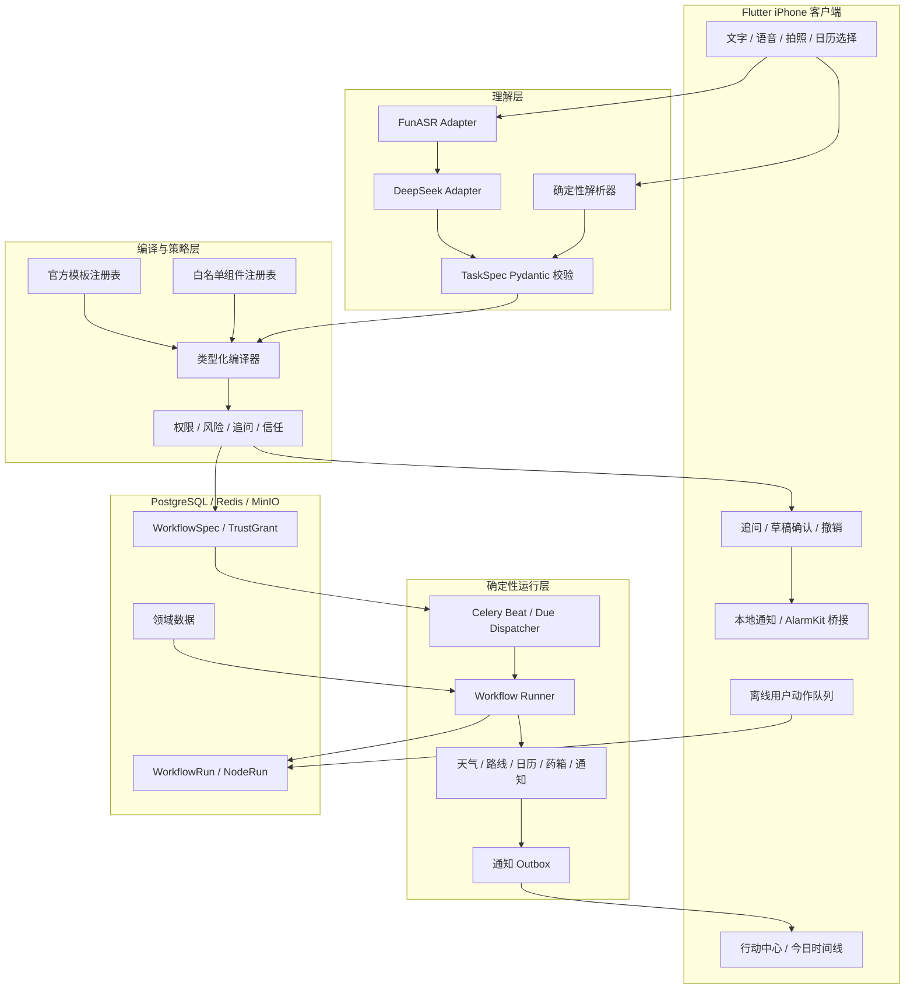

# 类型化生活助手 V1 最终设计

- 文档版本：1.1
- 日期：2026-08-06
- 状态：用户已确认，待实施
- 产品阶段：单人 iPhone 亲友内测
- 上位设计：`2026-08-03-smart-life-reminder-design.md`
- 后续路线图：`2026-08-05-smart-reminder-v2-enhancements.md`

## 1. 文档目的与适用关系

本文档把“智能提醒 App”收敛为可实施的 V1 产品：以周期用药、药品有效期和智能出门三个闭环验证类型化工作流内核，并为未来的开放式生活助手保留演进路径。

讨论中的方向代号定义如下：A 表示少量经过验证的高频生活工作流；B 表示用户自由表达目标后由系统受控编排；C 表示药品、有效期和用药提醒等健康垂直能力。因此 V1 为 A+C，长期方向为 B+C。

本文档是 2026-08-03 总体设计的专项更新。发生冲突时，以本文档对以下事项的决策为准：

- V1 首发用户为单人用户，不在首版实现家庭协作。
- V1 产品验证范围为周期用药、药品有效期和智能出门三个核心闭环。
- 首页采用“待决策优先，其次今日时间线”的行动中心。
- 模型只负责理解和组装候选计划，确定性系统负责授权、编译、调度和执行。
- 新类型首次确认；已信任的同类低风险工作流可以直接创建并允许撤销。
- V1 只查询信息、创建提醒和打开外部 App，不代替用户提交预约、购票或交易。

旧设计中的基础设施、OCR、ASR、iPhone 优先和医疗安全边界继续有效。家庭协作、更多模板、开放式意图编排和外部操作统一进入 V2 路线图。

## 2. 产品定义

产品定位为“把生活意图转化为可靠行动的主动式提醒助手”。它不是通用聊天机器人，也不是可以自由调用外部工具的开放 Agent。

产品的核心循环为：

```text
表达意图 -> 生成候选计划 -> 必要时追问或确认 -> 持久执行
         -> 在运行时查询事实 -> 提醒用户行动 -> 记录结果
```

聊天、语音和照片只是输入方式。用户最终看到的是可核对的工作流、待决策事项、今日时间线和执行结果，而不是一段无法确认是否已经生效的聊天记录。

## 3. 已确认决策

| 决策 | V1 结论 | 后续方向 |
|---|---|---|
| 产品心智 | 智能提醒助手 | 生活智能助手 |
| 首发用户 | 仅本人使用 | V2 增加家庭共享与照护 |
| 核心闭环 | 周期用药、药品有效期、智能出门 | 洗车、还款、买票、餐馆等更多模板 |
| 首页 | 待决策优先，下方今日时间线 | 增加跨日计划和更主动的建议 |
| 实现路线 | 类型化工作流编译器，官方模板先行 | 受控开放式意图编排 |
| 大模型职责 | 生成候选 `TaskSpec` 和歧义 | 检索并组合更多已验证组件 |
| 执行职责 | 确定性编译器与运行时 | 不改变安全边界 |
| 自动创建 | 新类型首次确认；可信低风险同类可直接创建 | 按真实行为逐步扩大可信范围 |
| 外部动作 | 查询、提醒、打开深链接 | V2 可评估逐次确认后的提交 |
| 调度 | PostgreSQL + Celery + Redis | 达到长流程复杂度后评估 Temporal |
| 条件表达 | Pydantic 判别联合类型与注册执行器 | 用户工作流成熟后评估 CEL |
| 模板检索 | 规则与显式模板匹配 | 模板规模增长后评估 pgvector |

## 4. V1 范围

### 4.1 必须完成

- 文字和短语音输入，生成统一的工作流草稿。
- 简单时间表达由本地规则解析，复杂多条件表达由 DeepSeek 生成受约束候选数据。
- 必要时每轮只追问一个最关键的阻塞问题。
- 工作流草稿展示时间、条件、数据来源、动作、权限和不确定项。
- 新类型首次确认；已信任低风险类型可直接创建并短时撤销。
- 首页按“需要你决定”“接下来”组织信息。
- 周期用药、药品有效期和智能出门三个端到端闭环。
- 已确认工作流在模型、ASR 或 OCR 不可用时继续运行。
- 外部 Provider 失败时显式降级，不静默漏提醒。
- iPhone 本地通知与服务端动态预检查协同工作。
- 工作流、运行和用户动作可追溯且保持幂等。

### 4.2 保留的现有能力

- 普通单次提醒和简单中文时间解析。
- FunASR 短语音转写。
- DeepSeek 严格 JSON 候选解析。
- 药盒 RapidOCR 与候选字段人工确认。
- 药品档案与库存批次分离。

这些能力是三个核心闭环的基础，不作为额外的第四、第五条产品主线。

### 4.3 明确不做

- 家庭邀请、共享药箱、家人服药状态和跨成员通知。
- 让模型直接调用天气、地图、数据库、通知或删除接口。
- 让模型在运行时自由改变已确认工作流。
- 自动诊断、推荐药品、推荐剂量或给出补服建议。
- 自动预约、购票、下单、支付或提交不可逆外部操作。
- 开放式用户自定义脚本、任意表达式或无限循环工作流。
- 实时公交车辆级到站承诺；V1 使用地图 Provider 可提供的路线和预计耗时。
- Android、实时流式语音、可穿戴设备和智能药盒硬件。

## 5. 用户体验

### 5.1 首页：行动中心

首页不是聊天记录，固定采用以下信息层级：

1. `需要你决定`：到点待服药、漏服待处理、过期药品、Provider 降级、需要补充的草稿。
2. `接下来`：今天剩余提醒、建议出门时间和已安排事项。
3. 快速输入：固定在页面底部的语音和文字入口。
4. `刚刚创建`：直接创建的可信工作流默认在 10 分钟内显示撤销入口。

默认不把全部药品、全部历史运行或长对话平铺在首页。用户进入详情页查看工作流来源、条件、最近执行和授权状态。

### 5.2 创建体验

```text
输入 -> 转写/解析 -> TaskSpec -> 编译 -> 策略判断
                                      |-> 追问一个问题
                                      |-> 展示草稿确认
                                      `-> 可信低风险类型直接创建
```

草稿页使用业务语言展示以下内容：

- 要做什么。
- 何时触发和是否重复。
- 届时会查询什么数据。
- 满足或不满足条件时分别提醒什么。
- 会访问哪些权限和外部 Provider。
- 哪些信息由系统默认，哪些仍不确定。

用户不需要理解 DAG、节点、Schema 或 Provider Adapter 等技术概念。

### 5.3 管理体验

- 工作流支持暂停、恢复、修改、删除和查看最近运行。
- 修改结构、敏感字段或权限后重新走草稿确认。
- 设置页提供“已信任类型”，用户可以随时撤销授权。
- 删除工作流不会删除药品、服药记录或日历来源数据，除非用户明确选择删除对应业务数据。

## 6. 总体架构



### 6.1 不变量

- `WorkflowSpec` 是已确认工作流的唯一事实来源。
- 模型输出永远是候选数据，不能成为可执行命令。
- 运行时只执行注册组件，不接受任意函数名、URL、代码或表达式。
- 已创建工作流不依赖模型、ASR 或 OCR 才能继续运行。
- 每次运行和通知都有稳定幂等键。
- Provider 失败必须产生可观察状态或降级通知，不能静默吞掉。

## 7. 模型理解链路

### 7.1 调用模型的条件

以下输入优先由本地规则处理，不调用大模型：

- “明早八点提醒我还信用卡”。
- “20 分钟后提醒我喝水”。
- 已存在可信模板的短指令，并且本地规则能完整提取参数。

以下情况可以调用 DeepSeek：

- 一句话包含多个时间、条件或动作。
- 需要从自然语言判断模板类型。
- 用户使用省略、指代或上下文表达。
- 本地规则无法形成合法 `TaskSpec`。

### 7.2 TaskSpec

模型只输出 `TaskSpec`，示例：

```json
{
  "schema_version": 1,
  "intent": "create_workflow",
  "template_hint": "smart_departure",
  "title": "明早去公司",
  "slots": {
    "arrival_time": "2026-08-07T09:00:00+08:00",
    "destination_text": "公司",
    "travel_mode": "public_transit",
    "weather_advice": true
  },
  "requested_capabilities": [
    "place.resolve",
    "route.estimate",
    "weather.forecast",
    "notification.important"
  ],
  "ambiguities": []
}
```

约束如下：

- `extra="forbid"`，拒绝未知字段。
- 模型只能引用提示中提供的模板键和能力键。
- `template_hint` 只是模型提供的候选提示；编译器必须根据合法槽位、请求能力、用户权限和启用模板重新选择，不能直接信任该字段。
- 模型不接收数据库凭据、Provider Key、完整药箱或完整日历。
- 用户输入按数据处理，不能覆盖系统 Schema、安全边界或工具白名单。
- 模型返回的实体文本必须由服务端根据当前用户权限重新解析。
- 不保存模型思维过程，不依赖模型自报置信度决定是否执行。

### 7.3 WorkflowSpec

编译器把合法 `TaskSpec` 转换成不可由模型直接控制的 `WorkflowSpec`：

```json
{
  "schema_version": 1,
  "template_key": "smart_departure",
  "template_version": "1.0.0",
  "timezone": "Asia/Shanghai",
  "nodes": [
    {"id": "trigger", "type": "trigger.before_arrival", "config": {}},
    {"id": "route", "type": "source.route_eta", "config": {"mode": "public_transit"}, "failure_policy": {"mode": "degrade", "fallback": "route.last_success_or_static"}},
    {"id": "weather", "type": "source.weather_forecast", "config": {}, "failure_policy": {"mode": "degrade", "fallback": "weather.unavailable"}},
    {"id": "departure", "type": "decision.departure_time", "config": {"buffer_minutes": 10}},
    {"id": "notify", "type": "action.important_notification", "config": {}}
  ],
  "edges": [
    ["trigger", "route"],
    ["trigger", "weather"],
    ["route", "departure"],
    ["weather", "departure"],
    ["departure", "notify"]
  ]
}
```

V1 工作流必须是有限、有向、无环图。周期由 Trigger 表达，不允许用图内循环实现。每个节点声明输入和输出 Schema，编译器在保存前完成类型、权限、依赖、可达性和环检测。

每个可失败节点还必须声明编译器允许的 `failure_policy`：

- `fail`：关键事实缺失，终止正常分支并进入固定故障通知。
- `degrade`：执行注册表中的固定回退，产生通过降级输出 Schema 校验的数据后继续。
- `skip`：只允许跳过被组件 Schema 标记为可选的支路，不能跳过 Trigger、关键 Decision 或最终兜底通知。

Source 输出使用判别联合类型表示 `ok`、`degraded` 或 `unavailable`。智能出门中，路线失败必须降级为最近一次成功估时或用户静态通勤时长；天气失败产生 `unavailable`，`decision.departure_time` 接受该可选天气状态并继续计算。正常通知或固定故障通知至少有一条可达路径，Runner 不得因并行 Source 单点失败静默结束。

## 8. 追问、确认与信任

### 8.1 何时追问

只有以下情况追问：

- 缺少执行必需字段。
- 同一个表达存在多个合理且行为不同的解释。
- 用户引用的药品、地点或日历事件无法唯一解析。
- 字段之间冲突，例如结束日期早于开始日期。

不追问以下信息：

- 未来天气、届时路况等只能在运行时获得的数据。
- 可由明确用户偏好填充的低风险、可逆默认值。
- 不影响执行的通知文案风格。

每轮只问一个最能缩小解释空间的问题。用户回答后重新生成并校验完整 `TaskSpec`，最多连续追问三轮；仍无法形成合法草稿时转为结构化表单，不继续开放式对话。

明确包含多个相互独立意图时，系统最多拆分为三个 `DraftGroup` 子草稿，例如把“提醒吃药”和“出门时看天气”分别编译。每个子草稿独立校验、确认和撤销，R2 草稿不能与低风险草稿合并确认。存在跨意图依赖或无法稳定拆分时不自动拆分，转为结构化表单让用户选择先处理哪一项。

### 8.2 能力签名

信任对象不是用户原话，而是规范化能力签名。签名输入包括：

- `template_key` 与模板主版本。
- 读取的数据类别和 Provider 类别。
- 动作类型与通知等级。
- 作用对象范围：本人、他人或家庭。
- 风险等级和所需系统权限。
- 是否包含健康、位置或外部提交能力。

具体日期、普通标题和同类地点参数不进入签名，避免每次都成为新类型。药品身份、用量字段类别、通知他人和外部提交属于敏感变化，会强制重新确认。签名使用规范化 JSON 的 SHA-256 保存，不把自然语言原文作为授权依据。

### 8.3 风险等级

| 等级 | 示例 | 创建规则 |
|---|---|---|
| R0 信息型 | 查询天气并形成普通建议 | 首次确认后可直接创建 |
| R1 本人提醒 | 智能出门、普通周期提醒 | 首次确认后，同签名可直接创建 |
| R2 健康与权限敏感 | 新建用药计划、修改用量文字、扩大日历或位置权限 | 每次确认 |
| R3 外部不可逆动作 | 购票提交、预约提交、支付、通知他人 | V1 不支持 |

R0-R3 描述的是创建、修改和授权行为的风险，不是通知展示等级。通知等级由 Action 组件决定：同一个 R2 用药计划在确认后，可以按既定计划重复执行 `action.important_notification`，不需要每次重新确认；任何用量、周期、药品或权限变化仍重新进入 R2 确认。

直接创建还必须同时满足：无歧义、Schema 完整、权限有效、模板版本兼容、用户未撤销信任且风险不高于 R1。创建后在首页显示结果，并提供默认 10 分钟的撤销窗口。撤销只取消尚未执行的本地和服务端调度；已经创建的 `WorkflowRun`、用户动作和审计记录继续保留，已送达通知不尝试召回。

## 9. 白名单组件注册表

V1 只注册三个模板实际需要的组件：

| 类别 | 组件 | 用途 |
|---|---|---|
| Trigger | `trigger.once` | 单次时间触发 |
| Trigger | `trigger.recurrence` | 每日或指定星期重复 |
| Trigger | `trigger.before_expiry` | 到期前指定天数触发 |
| Trigger | `trigger.before_arrival` | 到达时间反推预检查 |
| Source | `source.inventory_batch` | 读取药品批次和有效期 |
| Source | `source.calendar_event` | 读取用户明确导入的日历事件 |
| Source | `source.weather_forecast` | 查询出发至到达窗口的天气 |
| Source | `source.route_eta` | 查询指定交通方式的预计耗时 |
| Decision | `decision.threshold` | 判断数值阈值 |
| Decision | `decision.earliest_deadline` | 生产有效期与开封期取较早者 |
| Decision | `decision.departure_time` | 到达时间减路线耗时和缓冲 |
| Decision | `decision.change_detected` | 判断出门时间或风险是否明显变化 |
| Action | `action.local_notification` | 安排普通本地通知 |
| Action | `action.important_notification` | 重要通知和操作按钮 |
| Action | `action.alarm` | 用户明确选择的强提醒 |
| Action | `action.open_deep_link` | 打开地图或相关 App |
| Callback | `callback.medication_action` | 已服、稍后、跳过状态回写 |

周期用药模板固定编译为 `trigger.recurrence`、`action.important_notification` 和 `callback.medication_action` 的组合。Action 负责通知展示和按钮，Callback 只处理经过认证且幂等的用户动作；二者不能合并为模型可配置的任意回调。

注册项包含 Pydantic 配置 Schema、正常与降级输出 Schema、允许的失败策略和固定 fallback、风险等级、所需权限、执行器版本、超时策略及可重试错误集合。数据库只保存注册键和配置，不保存可执行代码。

## 10. 三个核心闭环

### 10.1 周期用药

#### 创建

- 用户从药箱选择药品或通过输入匹配到唯一药品。
- 用户录入医嘱给出的用量文字、开始日期、结束日期或长期状态、每日时间及适用星期。
- 系统可以检查时间格式和计划冲突，但不判断用量是否合理。
- 新建或修改药品、用量文字、周期和服药人均为 R2，每次确认。
- 确认后使用 `trigger.recurrence` 物化服药实例，并由 `action.important_notification` + `callback.medication_action` 完成提醒和状态回写；重复执行的通知等级不改变计划创建时的 R2 风险分类。

#### 执行

- 服务端在计划确认、计划修订和每日维护任务中，按本地时区幂等生成未来 30 天 `MedicationOccurrence`。
- 客户端同步未来已知时间并安排本地重要通知。
- 通知动作包括：已服、稍后提醒、跳过。
- “稍后提醒”默认 15 分钟，可在详情页修改；每次实例最多连续稍后三次。
- 默认在计划时间两小时后仍无动作时标记为 `needs_attention`，用户可以调整窗口。
- 只有“已服”才写入服药完成时间；关联库存时，只有已服动作才扣减估算数量。
- 离线动作先写客户端队列，联网后使用客户端动作 UUID 幂等同步。

#### 安全边界

- 不提供漏服后是否补服、何时补服或调整剂量的建议。
- 药品已经过期时不自动取消医嘱；行动中心提示核对药品并暂停库存关联，是否变更计划由用户决定。
- 删除用药计划保留既有服药记录，除非用户明确删除历史。

### 10.2 药品有效期

#### 录入

- App 分别拍摄药盒正面和日期区域。
- RapidOCR 与证据约束的语义解析只生成候选药名、规格、批号、生产日期和有效期。
- 用户确认后创建或关联 `MedicineItem`，并创建独立 `InventoryBatch`。
- OCR 原图按现有隐私策略在确认后删除，失败任务最多保留 24 小时。

#### 计算与提醒

- 厂商有效期来自 `expiry_date`。
- 用户可以录入开封日期和说明书中的开封后期限，得到 `opened_use_before`。
- 实际管理截止日为两个日期中较早的非空值。
- 默认在截止日前 90、30、7 天和到期日通知；同一阈值只生成一次通知。
- 到期后该批次持续出现在“需要你决定”，但不每日重复推送。
- 用户可以标记已用完、已处理或修正日期，所有修正保留更新时间与来源。

#### 安全边界

- OCR 结果不能直接写入正式库存。
- 生产日期晚于有效期等冲突不自动交换或猜测。
- 系统不根据过期状态建议继续服用，也不自动删除批次。

### 10.3 智能出门

#### 创建

- 必填：目标到达时间、目的地和交通方式。
- 出发地可以选择“家”“公司”等保存地点，也可以在创建时输入；V1 不持续后台跟踪位置。
- 默认预留时间为 10 分钟，用户可以按工作流调整。
- 用户可以从 iOS 日历明确选择一个事件导入到达时间和目的地。V1 不默认上传完整日历。
- 支持步行、驾车和公共交通路线估时；公交实时车辆到站能力取决于地图 Provider，不作产品承诺。

#### 执行

1. 创建时查询一次路线，形成基准预计耗时和建议出门时间。
2. 在基准出门时间前两小时进行天气和路线预检查。
3. 在基准出门时间前二十分钟再次查询。
4. 推荐出门时间变化至少五分钟，或降雨风险从无变有时，更新行动中心并发送重要通知。
5. 通知展示建议出门时间、预计耗时、天气风险和“打开导航”。

天气窗口覆盖出发时间至预计到达后 30 分钟。降雨阈值默认使用 Provider 的降水类型或 40% 降水概率，用户可以在模板设置中调整。

#### 降级

- 路线查询失败：使用最近一次成功结果；没有历史结果时使用用户设置的静态通勤时长。
- 天气查询失败：仍然发送出门提醒，并明确显示“天气暂不可用”。
- APNs 不可用：保留客户端基准本地通知；动态更新时间可能无法送达，并在设备诊断页说明。
- 日历权限撤销：保留已经确认的事件快照，停止读取后续变化并提示重新授权。

## 11. 数据模型

### 11.1 创建与授权

`WorkflowTemplate`

- `key`、`semantic_version`、`schema_version`。
- `capability_manifest_json`、`risk_level`、`status`；状态为 `active`、`deprecated` 或 `disabled`。
- 模板升级只在主版本或能力签名变化时使既有 TrustGrant 失效。
- `deprecated` 禁止新建但允许兼容的既有工作流继续运行；关联 TrustGrant 保留用于审计但不能再用于直接创建。`disabled` 用于安全或供应商下线等紧急情况，会撤销关联 TrustGrant、暂停既有工作流并进入迁移确认。模板迁移不能由模型自动完成。

`DraftGroup`

- `user`、`source_session`、`input_digest`、`status`、`expires_at`、`created_at`。
- 一个 Group 最多关联三个 `ReminderDraft`，每个子草稿保存 `group_position` 并独立确认、取消和过期。
- Group 只聚合同一次多意图输入，不提供跨草稿事务确认。

`ReminderDraft` 扩展

- 保留现有 `draft_json` 与 `ambiguities_json` 兼容字段。
- 新增或逐步迁移为 `task_spec_json`、`workflow_spec_json`、`policy_result_json`。
- `status` 支持 `needs_clarification`、`pending_confirmation`、`auto_created`、`confirmed`、`cancelled`、`expired`。
- 草稿默认 30 分钟过期。

`TrustGrant`

- `user`、`capability_signature`、`template_key`、`template_major_version`。
- `scope_json`、`granted_at`、`last_used_at`、`revoked_at`。
- 用户与未撤销签名唯一。

### 11.2 调度与执行

`ReminderRule` 扩展

- 保留现有标题、时区、等级和启用状态。
- 新增 `template_key`、`template_version`、`schema_version`、`workflow_spec_json`。
- 新增 `next_run_at`、`last_run_at`、`revision` 和 `paused_reason`。
- `next_run_at` 可空，使用 UTC 存储并建立部分索引；用药父规则依赖 Occurrence 级调度，因此该字段为空。

`WorkflowRun`

- `rule`、`scheduled_for`、`run_kind`、`idempotency_key`。
- `status`、`started_at`、`finished_at`、`error_code`、`degraded`。
- `idempotency_key` 唯一，防止重复 Worker 产生重复通知。

`WorkflowState`

- `rule`、`state_schema_version`、`state_json`、`revision`、`updated_at`。
- 保存运行所需的最小可变基线，例如最近一次成功路线估时、上次推荐出门时间、天气风险和结果指纹。
- 使用乐观 revision 或行锁更新；它不是审计日志，历史仍以 `WorkflowRun` 和 `NodeRun` 为准。

`NodeRun`

- `workflow_run`、`node_id`、`executor_version`、`attempt`。
- `status`、`input_digest`、`output_json`、`error_code`、`duration_ms`。
- 不记录凭据、完整日历、原始音频或 OCR 原文。

`NotificationOutbox`

- `workflow_run`、`channel`、`device`、`payload_json`、`idempotency_key`。
- `status`、`attempt_count`、`next_attempt_at`、`provider_message_id`、`error_code`。

### 11.3 领域数据

- 沿用 `MedicineItem` 与 `InventoryBatch`，为批次增加开封日期、开封后期限、实际截止日缓存、状态和来源。
- 新增 `MedicationPlan`，一对一关联确认后的父 `ReminderRule`，保存用户输入的用量文字、周期、时区、开始结束日期和关联药品。
- 新增 `MedicationOccurrence`，保存计划时间、`next_notification_at`、`notification_generation`、状态、实际动作时间、稍后次数和客户端动作 UUID；`plan + scheduled_for` 唯一。
- 新增 `PlaceProfile`，保存本人常用地点的规范化 Provider 地点 ID、展示名和加密后的必要坐标。
- 智能出门的日历事件只保存用户选择的外部 ID、必要事件快照和最近同步时间。

健康、位置和日历字段按用途最小化保存。V1 模型预留 `owner`，不增加家庭归属或跨成员权限表。

## 12. 调度与执行

### 12.1 Due Dispatcher

- Celery Beat 每分钟触发一次调度维护任务，分别处理 Rule 级和 MedicationOccurrence 级到期对象，两类对象共用 `WorkflowRun`、Runner 和 Outbox，不共用模糊的调度游标。
- 普通提醒、药品有效期和智能出门属于 Rule 级调度。Dispatcher 查询 `enabled=true AND next_run_at<=now` 的规则，使用 `select_for_update(skip_locked)` 分批抢占。
- 用药计划在确认、修订及每日维护时物化未来 30 天实例。Occurrence Dispatcher 查询 `next_notification_at<=now` 且仍待处理的实例，幂等键为 `medication:{occurrence_id}:{notification_generation}`；“稍后提醒”递增 generation 并设置新的 `next_notification_at`。
- Rule 级调度在同一事务中创建唯一 `WorkflowRun` 并推进 `next_run_at`，事务提交后再投递执行任务。Rule 运行幂等键由 `rule_id + scheduled_for + run_kind` 构成。
- 有效期批次确认后创建 Rule，并把 `next_run_at` 指向下一个未触发阈值。日期修正时在同一事务中递增 Rule revision、取消未发送 Outbox 与客户端调度、重新计算阈值和 `next_run_at`；如果修正后的日期已经跨过多个未提醒阈值，只立即生成一条当前最高严重度通知并把更早阈值标记为已覆盖。运行幂等键包含 `batch_id + effective_deadline + threshold`。
- Worker 重试不会重新推进规则游标，也不会生成第二个逻辑运行。
- 服务器统一使用 UTC；所有周期计算使用规则保存的 IANA 时区。

### 12.2 Runner

- Runner 按拓扑顺序执行有限 DAG。
- 节点只能从 Component Registry 获取执行器。
- 节点输出先通过 Pydantic 校验，再传递给下游。
- 可重试错误使用有上限的指数退避；业务拒绝、权限撤销和 Schema 错误不自动重试。
- Source 失败时按已编译的 `failure_policy` 生成合法降级输出或进入固定故障通知；Runner 不临场询问模型如何处理。
- `decision.change_detected` 从 `WorkflowState` 读取上次成功基线，并在本次运行提交副作用后原子更新状态。
- 结果指纹用于变化判断和状态去重，不替代 `WorkflowRun` 幂等键。Outbox 幂等键由逻辑检查时点、Action 节点和通知代次构成，Provider 重试不会因返回结果变化产生第二个逻辑运行。
- 运行结束后计算下一次时间、降级状态和用户可见结果。

### 12.3 通知可靠性

- 静态已知时间在客户端安排本地通知，服务端保存对应设备调度回执。
- 动态天气和路线结果通过 APNs 推送；推送由 Transactional Outbox 发送。
- 同一逻辑提醒的本地与服务端通知共享业务去重键，客户端收到动态通知后更新或替换基准通知。
- 客户端通知动作使用 UUID 幂等回写；重复点击或离线重放不产生重复状态。
- V1 亲友内测必须有设备诊断页，显示通知权限、本地调度、APNs Token、最近同步和时区状态。

## 13. Provider 与技术选型

### 13.1 V1 使用

| 能力 | 技术或 Provider | 说明 |
|---|---|---|
| App | Flutter + iOS 原生桥接 | iPhone 优先，本地通知与 AlarmKit 分版本接入 |
| API | Django 5.2 + DRF | 沿用现有认证、模型和管理后台 |
| Schema | Pydantic 2 | TaskSpec、WorkflowSpec、节点配置和输出校验 |
| 数据库 | PostgreSQL | 领域数据、工作流、信任、执行和 Outbox |
| 调度 | Celery 5 + Redis | Beat、Dispatcher、Worker 和有界重试 |
| LLM | DeepSeek Adapter | 只生成受约束候选 JSON，可替换 Provider |
| ASR | 自建 FunASR | 20 秒以内中文短语音，非流式 |
| OCR | RapidOCR + 证据约束语义解析 | 候选结果必须人工确认 |
| 天气 | 和风天气 Adapter | 超时、缓存、限流和显式降级 |
| 路线 | 高德地图 Adapter | 国内地点解析、步行、驾车和公共交通估时 |
| 日历 | iOS EventKit 经 Flutter 原生桥接 | 用户授权并明确选择事件 |
| 推送 | APNs Provider | 动态预检查结果；本地通知作为基准兜底 |

所有外部能力通过项目自有 Provider Protocol 暴露，业务代码不直接依赖供应商 SDK 返回结构。

### 13.2 V1 不引入

- 不用 LangChain 或 LangGraph 承担核心调度。
- 不用 Temporal 承担只有三个官方模板的运行时。
- 不用 pgvector 做只有少量模板的检索。
- 不用 CEL 或 JsonLogic 表达尚未开放给用户的任意条件。
- 不用 Kubernetes、复杂事件总线或长期音频队列。

这些技术的进入条件写入 V2，而不是永久排除。

## 14. API 设计

### 14.1 工作流草稿

| 方法 | 路径 | 用途 |
|---|---|---|
| POST | `/api/v1/workflow-drafts` | 文字或已完成转写的统一草稿入口 |
| GET | `/api/v1/workflow-drafts/{id}` | 查询解析、追问或草稿状态 |
| POST | `/api/v1/workflow-drafts/{id}/answers` | 回答一个结构化追问并重新编译 |
| POST | `/api/v1/workflow-drafts/{id}/confirm` | 确认草稿并创建工作流 |
| POST | `/api/v1/workflow-drafts/{id}/cancel` | 取消并清理临时数据 |

现有 `/api/v1/reminder-drafts` 和 `/api/v1/voice/reminder-drafts` 在迁移期作为 `compat_profile=legacy_once` 的兼容入口，内部调用同一个 Draft Service，不复制确认逻辑。旧路径只接受现有单次简单提醒契约，继续返回旧字段投影，并与新路径使用相同的 30 分钟过期、确认幂等和权限语义；如果输入只能编译为新模板或需要新客户端追问，返回 `422 unsupported_workflow_for_client` 和升级提示，不静默降级成错误的单次提醒。

### 14.2 行动中心与工作流

| 方法 | 路径 | 用途 |
|---|---|---|
| GET | `/api/v1/action-center/today` | 返回待决策事项、今日时间线和刚创建项目 |
| GET | `/api/v1/workflows` | 列出本人的工作流 |
| GET | `/api/v1/workflows/{id}` | 查看规范化业务摘要和最近运行 |
| PATCH | `/api/v1/workflows/{id}` | 暂停、恢复或修改；结构变化返回新草稿 |
| DELETE | `/api/v1/workflows/{id}` | 删除工作流，不隐式删除领域记录 |
| POST | `/api/v1/workflows/{id}/undo-create` | 默认在创建后 10 分钟内取消未执行调度；保留已执行记录且不召回已送达通知 |
| GET | `/api/v1/trust-grants` | 查看已信任类型 |
| DELETE | `/api/v1/trust-grants/{id}` | 撤销信任，不删除既有工作流 |

### 14.3 用药、药品和设备

| 方法 | 路径 | 用途 |
|---|---|---|
| POST | `/api/v1/medication-plans` | 创建用药计划草稿 |
| GET | `/api/v1/medication-occurrences` | 查询时间范围内服药实例 |
| POST | `/api/v1/medication-occurrences/{id}/actions` | 已服、稍后或跳过，使用动作 UUID 幂等 |
| GET | `/api/v1/medicine-batches` | 查询批次与临期状态 |
| POST | `/api/v1/devices` | 注册通知能力、APNs Token 和时区 |
| POST | `/api/v1/devices/{id}/schedule-receipts` | 回报本地通知安排结果 |

OCR API 保持现有契约；确认 OCR 后由领域服务创建批次并编排有效期工作流。

### 14.4 通用响应要求

- 所有写接口支持请求幂等键。
- 所有资源按当前认证用户隔离。
- 返回固定 `error_code`、用户可读摘要和可恢复动作，不把底层异常原文返回客户端。
- API 不接受客户端提交的任意组件键、风险等级或 `trusted=true`；这些值由服务端计算。
- 删除工作流必须来自已认证客户端的交互式确认；V1 不向模型或语音意图开放删除能力。
- 使用 Redis 令牌桶实施按用户和 IP 的可配置限流，默认文字草稿 30 次/10 分钟、需要 LLM 的解析 20 次/小时、语音上传 10 次/10 分钟；超限返回 `429 rate_limited` 与 `Retry-After`。单次音频继续受 20 秒和上传大小限制，服务端设置每日可配置模型成本上限，达到上限后回退本地解析或结构化表单。

## 15. 错误处理与降级

| 场景 | 系统行为 | 用户可见结果 |
|---|---|---|
| FunASR 忙或不可用 | 保留音频短期状态，允许重试或改文字 | 明确提示语音暂不可用 |
| DeepSeek 超时或非法 JSON | 回退本地解析；无法完成则转结构化表单 | 不生成未经校验的草稿 |
| OCR 失败 | 保留人工录入入口，按既有策略重试和清理图片 | 可以手工完成药品录入 |
| 天气失败 | 继续出门提醒，不给带伞结论 | 显示天气暂不可用 |
| 路线失败 | 使用最近结果或静态通勤时长 | 标记为估算值 |
| APNs 失败 | 重试 Outbox，保留基准本地通知 | 设备诊断显示动态更新异常 |
| 通知权限撤销 | 停止声称通知已安排 | 行动中心持续提示修复权限 |
| 日历权限撤销 | 使用已确认快照，不继续同步 | 提示重新授权或改为手动维护 |
| Worker 重复执行 | 唯一幂等键拒绝重复副作用 | 用户只看到一条逻辑提醒 |
| Schema 或模板版本不兼容 | 暂停受影响工作流并要求重新确认 | 不使用模型临时修复 |
| 模板 deprecated | 禁止新建，兼容既有工作流继续运行 | 详情页提示未来迁移 |
| 模板 disabled | 暂停既有工作流并取消未执行调度 | 行动中心要求迁移或删除 |

## 16. 安全、隐私与医疗边界

### 16.1 模型与工具隔离

- DeepSeek、FunASR 和 OCR Provider 没有数据库写权限。
- 模型不获得可直接调用的执行工具，只接收允许模板和能力的文本描述。
- 服务端忽略模型输出的权限、用户 ID、信任状态、风险等级和任意 URL。
- 所有实体按当前用户权限重新解析，所有节点按注册 Schema 二次验证。
- 用户文本、日历标题和 OCR 文本都可能包含提示注入内容，始终作为数据字段处理。

### 16.2 数据最小化

- 不长期保存原始语音和完整转写。
- OCR 原图确认后删除，失败任务最多保留 24 小时。
- 不默认上传完整系统日历，只保存用户明确导入事件的必要快照。
- 位置保存为用户选择的常用地点，不在 V1 持续后台追踪。
- 日志不记录 Token、Provider Key、签名 URL、原始音频、完整 OCR 文本或完整模型响应。

### 16.3 医疗边界

- 用量文字是用户转录的医嘱信息，不是系统建议。
- 系统只提醒、记录和管理库存，不判断治疗效果。
- 漏服、过期和库存不足只触发核对提示，不给出补服、替代药或继续使用建议。
- 修改药品、用量、周期和服药人始终需要人工确认。

## 17. 可观测性

必须记录不含敏感原文的结构化指标：

- 草稿解析成功率、本地解析命中率、模型回退率。
- 平均追问轮数、草稿确认率、直接创建率和撤销率。
- 每类模板的创建、暂停和删除数量。
- Due Dispatcher 延迟、WorkflowRun 成功率、降级率和重复抑制数。
- Provider p50/p95 延迟、超时率、限流率和熔断状态。
- 本地调度成功率、APNs Provider 接受率和用户动作回写成功率；没有设备回执时不把 Provider 接受等同于实际送达。
- 用药通知到动作的时间分布、临期提醒处理率和智能出门时间更新率。

日志使用固定错误码和关联 ID：`request_id`、`draft_id`、`workflow_id`、`run_id`、`node_id`。默认不记录用户输入原文。

## 18. 测试策略

### 18.1 单元测试

- TaskSpec 和 WorkflowSpec 严格 Schema、未知字段拒绝和版本兼容。
- 模板匹配、组件白名单、DAG 环检测、输入输出类型检查。
- 节点 `fail/degrade/skip` 合法性、降级输出 Schema 和最终通知可达性。
- 能力签名规范化、TrustGrant 命中、撤销、模板升级、deprecated 和 disabled 状态。
- 追问优先级、最多三轮、多意图拆分、表单回退和高风险强制确认。
- 周期、时区变化、月底、跨年、暂停恢复和 next_run_at 计算。
- 有效期、开封期、阈值去重和过期后行动中心状态。
- 出门时间计算、五分钟变化阈值和 Provider 降级。

### 18.2 集成测试

- Draft Service 从本地解析、DeepSeek 回退到确认创建的完整链路。
- 多意图 DraftGroup、旧入口 `compat_profile=legacy_once`、不支持新模板时的 422 和一致过期语义。
- 用户/IP 令牌桶、模型成本上限、`Retry-After` 和本地/表单回退。
- Dispatcher 并发抢占、事务回滚、Worker 重试和唯一运行键。
- Rule 与 MedicationOccurrence 两条调度路径、用药实例物化、稍后代次和有效期日期修订重排。
- Notification Outbox 重试、本地通知去重和客户端动作幂等同步。
- WorkflowState 基线并发更新、变化判断和结果指纹不改变运行幂等。
- OCR 确认创建批次并生成有效期工作流。
- EventKit 事件导入、权限撤销和快照回退。
- 天气、路线、APNs 的超时、限流、非法响应和脱敏日志。

### 18.3 真机端到端测试

- iPhone 锁屏、后台、重启、断网、权限拒绝和时区变化。
- 设备重启后验证系统保留已安排本地通知；App 再次同步时不得重复安排同一业务通知。
- 周期用药的已服、稍后、跳过、离线动作和待处理状态。
- 药盒拍照、候选确认、90/30/7/0 阈值的测试时钟验证。
- 智能出门的日历导入、两次预检查、路线变化、天气失败和打开导航。
- 可信低风险同类直接创建、10 分钟内撤销和撤销 TrustGrant 后重新确认。

## 19. V1 验收标准

- 三个核心闭环均在 iPhone 真机完成创建、运行、通知、用户动作和状态回写。
- 100% 正式工作流来自通过 Pydantic 校验和编译器验证的 `WorkflowSpec`。
- 模型没有数据库写权限、通知权限或运行时工具调用能力。
- R2 用药计划及敏感修改 100% 经过人工确认。
- 没有有效 TrustGrant 时，低风险新类型不会直接创建。
- 重复投递和 Worker 重试不会产生重复逻辑通知或重复服药记录。
- Due Dispatcher 在服务健康时的调度延迟 p95 不超过 60 秒。
- 网络断开时，已同步的固定用药提醒仍能通过本地通知触发。
- 设备重启后，重启前已同步的固定提醒仍能触发；App 恢复同步不会产生重复通知。
- 天气或路线失败时，智能出门仍提供带明确降级标记的基础提醒。
- OCR 候选未经确认不能创建正式库存批次或到期工作流。
- 首页优先展示需要用户处理的事项，并可进入对应详情完成动作。
- 日志和异常中不出现凭据、完整语音、完整转写、OCR 原图或完整日历内容。

## 20. 兼容迁移

- 现有 `ReminderDraft` 和 `ReminderRule` 原地扩展，不删除现有字段。
- 既有一次性提醒迁移为 `legacy_once` 模板的 WorkflowSpec，保留原始创建时间和来源草稿。
- 现有 `/reminder-drafts` 与 `/voice/reminder-drafts` 接口在一个发布周期内保持兼容。
- 新旧客户端同时存在时，服务端按客户端能力返回可降级的草稿和提醒结构。
- 数据迁移分为加字段、回填、双读验证、切换读取、最后停止写旧结构；不在一次部署中删除旧字段。
- OCR 和药品实现如果位于独立工作分支，合并时以现有 `MedicineItem`、`InventoryBatch`、`OCRJob` 和 `OCRCandidate` 为事实基础。

## 21. 实施顺序边界

本文档不是逐任务实施计划，但实施必须按依赖顺序拆分：

1. WorkflowSpec、模板/组件注册表、编译器、策略和兼容迁移。
2. Dispatcher、Runner、Run/NodeRun、Outbox 和设备诊断。
3. 周期用药闭环。
4. 药品有效期闭环。
5. 智能出门、天气、路线、日历和 APNs 动态更新。
6. 行动中心、TrustGrant、直接创建与撤销。
7. 三条闭环的真机可靠性与隐私验收。

每一步进入编码前建立独立实施计划，不把整份设计作为单个巨大开发任务执行。

## 22. V2 延后事项

以下事项必须同步维护在 `2026-08-05-smart-reminder-v2-enhancements.md`：

- 家庭邀请、共享药箱、照护状态、跨成员通知和字段级权限。
- 从官方模板扩展到洗车、信用卡还款、节前买票、餐馆筛选和更多生活场景。
- 从模板匹配扩展到受控的开放式意图编排，即产品方向 B+C。
- 用户确认后的预约、购票等外部提交；支付和一次授权后的自动交易仍不纳入既定范围。
- 模板数量增长后的 pgvector 检索。
- 用户可组合条件成熟后的 CEL。
- 跨天等待、补偿和长流程复杂度达到阈值后的 Temporal。
- LangGraph 仅可用于非关键的规划实验，不能替代确定性运行时。
- Android、实时语音、多 Provider、公开发布合规和基础设施扩容。

## 23. 外部评审检查清单

外部评审应优先检查以下问题；如果建议改变已经确认的产品范围，应同时说明收益、成本和对 V1 交付周期的影响：

- TaskSpec 与 WorkflowSpec 的信任边界是否足以阻止模型越权。
- 能力签名是否遗漏会扩大权限或风险的结构变化。
- PostgreSQL + Celery 的调度、抢占和幂等设计能否支撑 V1 三个模板。
- 本地通知与 APNs 动态更新的去重和降级是否完整。
- 关系化领域数据与版本化 WorkflowSpec JSON 的边界是否合理。
- 用药、OCR、日历和位置数据的安全边界是否满足亲友内测。
- 三个闭环是否存在未定义的失败状态或静默漏提醒路径。
- V2 延后项是否会被 V1 的数据模型或接口锁死。
